# SSR 메모리 누수 디버깅 가이드 

[SSR 메모리 누수 디버깅 가이드][https://www.youtube.com/watch?v=P3C7fzMqIYg]
[박지혜 Github][https://github.com/flyingSquirrel-dev]

이 강의에서는 SSR 환경에서 발생할 수 있는 메모리 누수 문제를 해결하는 방법을 배웁니다.

- 메모리릭을 디버깅 할 수 다는 자신감이 생김. 
- Node.js 환경이든, 브라우저 환경이든 크롬 브라우저의 Memory 탭에서 메모리 누수의 범인을 찾을 수 있음. 

## 목차

1. 메모리 누수란?
2. 메모리 누수 모니터링
3. 메모리 누수 해결 방법
4. 대표적인 메모리 누수 원인
5. 실습: 메모리 누수 디버깅
6. 요약 및 Best Practices

## 1. 메모리 누수란? 

메모리 누수는 프로그램이 필요 없는 메모리를 계속 점유하는 상황을 의미합니다. 이는 성능 저하 및 서버의 불안정한 운영을 초래할 수 있습니다.

### 메모리 누수의 영향:

- 성능 저하
- 높은 CPU 사용률
- 프로세스의 비정상 종료
  
정원 초과, 항상 4명이 공간을 차지 해 엘레베이트가 효율적 사용 x 
-> 정원을 더 늘릴 수 있게, 더 큰 엘레베이터로 바꾸거나.
-> 자리를 차지만 범인을 내보냅니다. 

-> JS 는 동작시킬 메모리가 부족하니까, 성능이 좋지 않음.
GC 의 활동이 늘아나면, CPU 사용량이 늘어남.
CPU intensive 한 작업이 늘어나면, 이벤트 루프가 블로킹되어 연산이 느려집니다. 

띄워놓은 Node.js 서버가 죽음.

- SIGABRT 등의 시그널로 인한 프로세스 종료.
- 인스턴스가 재시작되고 일부 요청에 대한 응답이 실패할 수 있어요.
- 로드밸런서가 HTTP Status 502(Bad Gateway) 에러를 뱉을 수 있어요.
- 가용성에 문제가 있을 수 있단 뜻. 

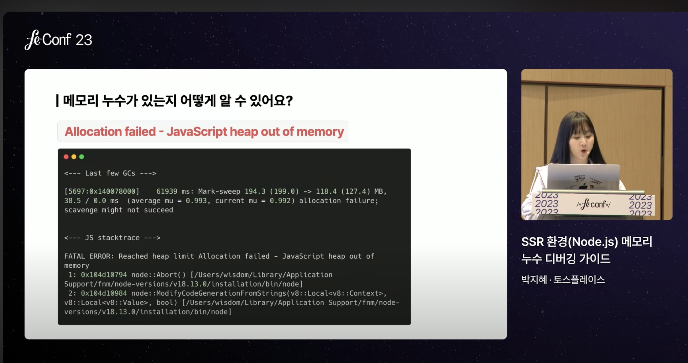

보통 터미널에서 만날 수 있는 문장은 이렇습니다. 
이 문구가 포함되면 heap 메모리가 부족하다는 뜻. 

-> 모니터링 툴을 관찰을 하게 됩니다. 

## 2. 메모리 누수 모니터링

기본적으로 클라이언트, 서버랑 나눠서 생각을 해야 합니다.
Client Side 는 약간 모니터링 도구을 붙이기는 어려움. 
하지만 디버깅 방법 자체는 2가지 모두 동일합니다. 

메모리 누수 없는 코드

25MB 평균으로 사용합니다. 
-> 메모리 누수가 없는 코드를 모니터링하면 이런식으로 보입니다. 
-> 별 다른 걱정을 안해도 됩니다. 
-> 중간에 배포를 한다면, 배포 사용량 내려갔다가, 고만고만 합니다.  
-> 일정한 그래프. 

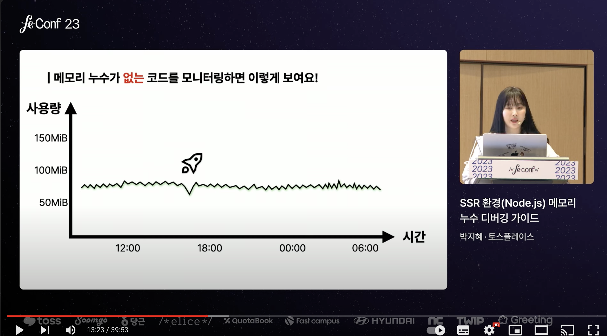

메모리 누수가 있는 코드 

33MB 에서 시작 했는데, 
결론적으로 시간이 흐를 수록 MB가 증가합니다. 
33MB에서 시작한 숫자가 193MB까지 증가 했습니다. 

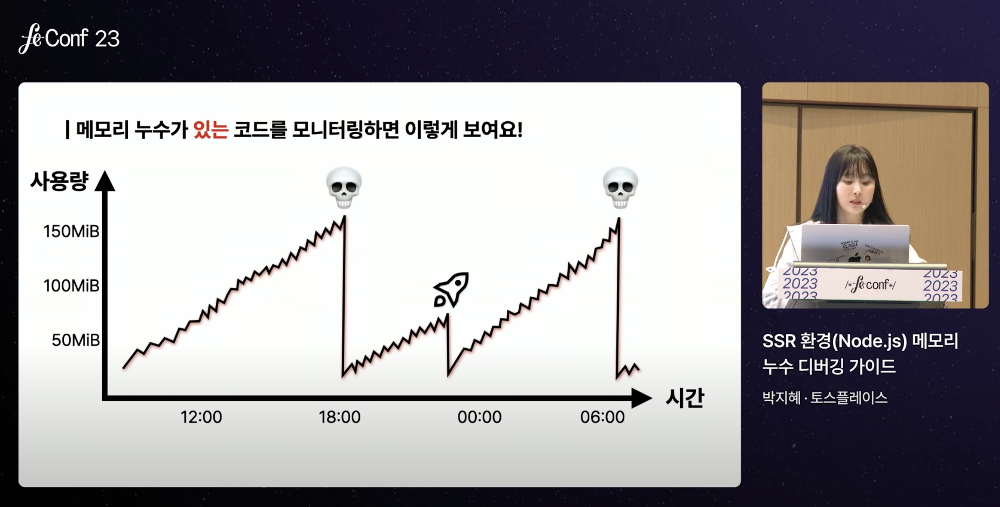

산 모양이면 -> 메모리 누수가 있다고 알 수 있습니다. 

## 3. 메모리 누수 해결 방법

방법 

1. 힙 메모리를 늘려주기. -> x 
2. 메모리 누수의 범인을 디버깅한다. 

메모리가 부족했으니까, 아까 그 코드는 메모리에서 자유로워 질까?
-> 힙메모리를 늘려줘도, 이코드는 계속 메모리 누수를 일으킵니다. 

V8이 메모리를 관리하는 방식을 알면 좋음. 

V8 은 메모리를 잘 관리하기 위해서 Mark And Sweep 이라는 알고리즘을 사용하고 있습니다. 
더 이상 참조하지 않는 곳은 가비지 콜렉션을 수행되면서, 불필요한 객체를 수거해서 확보 해 나갑니다. 

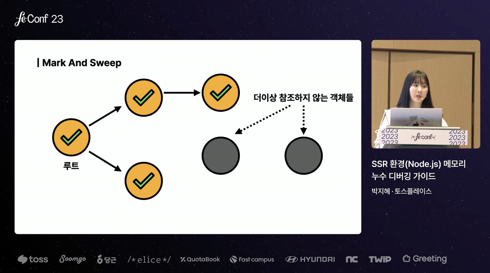

어디서 계속 참조하는 객체가 있다면 계속 힙 메모리에 존재합니다. 

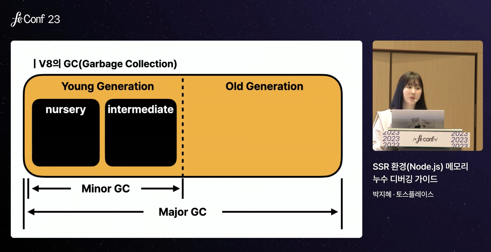

기본적으로 Young Generation(nursery, intermediate), Old Generation 

nursery - 메모리 할당이 이뤄짐.
intermediate - 가비지 콜렉션이 이뤄졌는데, 남았다면 여기로 이동. 여기에서도 살아나면 Old 로 이동합니다. 
Old Generation - 여기까지 살아남는 객체는 드뭄.

가비지 콜렉션에서 계속 살아남으면 Old Generation 에 쌓이게 됩니다. -> 결국 서버가 죽게 됩니다. 

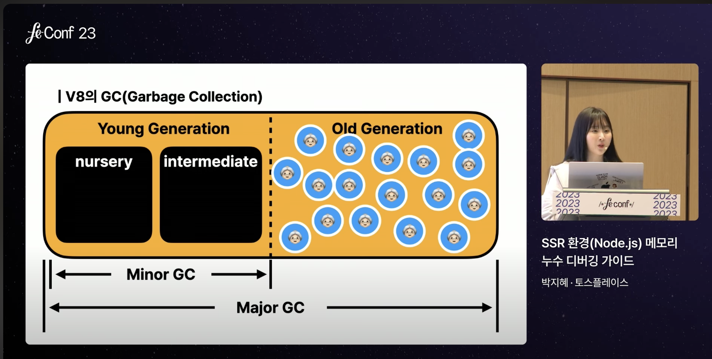

## 4. 대표적인 메모리 누수 원인

1. 전역변수 
2. 해제되지 않은 타이머 (clearTimeout 등)
3. 클로저 

## 5. 실습: 메모리 누수 디버깅

- `heap snapshot`을 사용하여 현재 힙 메모리 사용량 체크
- `Application instrumentation on timeline`을 통해 힙 메모리 할당 정보 기록 및 분석

cli 환경에서는 node --inspect index.js 를 실행하면 됩니다. 

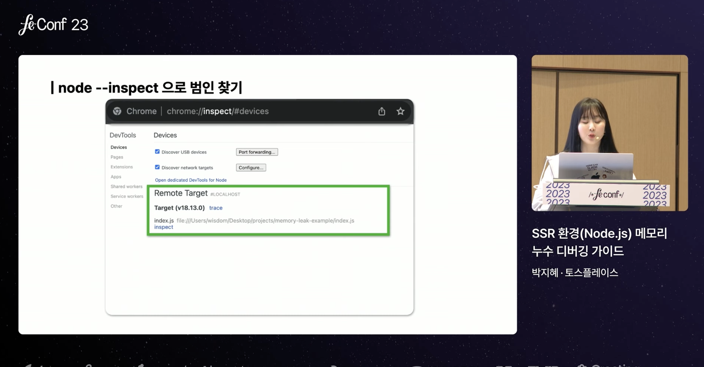

heap snapshot 지금 사용중인 heap 사용량을 체크 할 수 있습니다. 

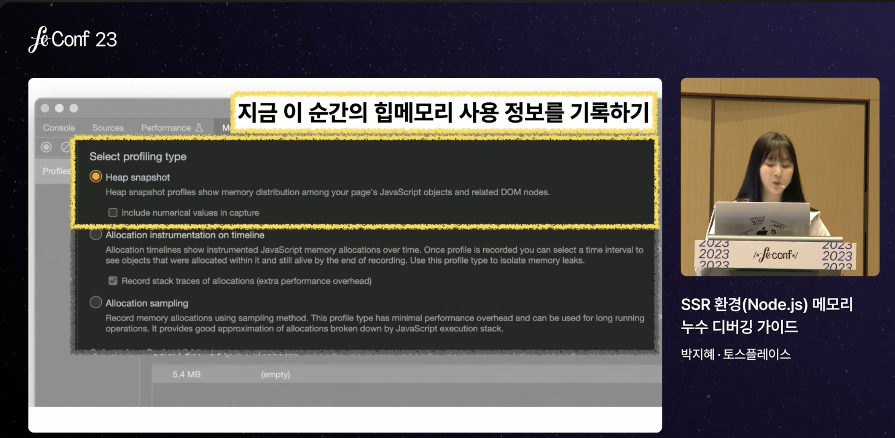

Appocation instrumentation on timeline (녹화하는 동안 주기적으로 힙메모리 할당 정보를 기록하기)

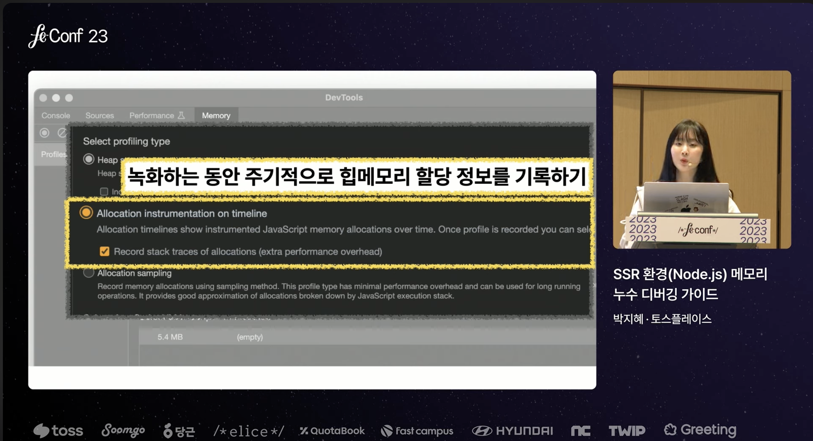

이 그래프를 보면, 메모리 사용량을 볼 수 있음. 
파란색이 많으면 힙 메모리 사용량이 많다는 의미 입니다. 

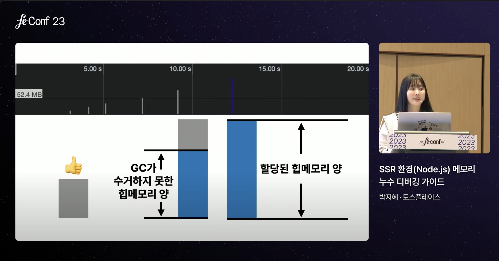

알아두면 좋음

- Shallow Size : 오브젝트 자신의 크기 (bytes)
- Retained Size : 나 자신 + 참조하고 있는 오브젝트들의 크기 (bytes)
-> Shallow Size 크기 대비해서 Retained Size 를 큰 것을 찾으면 됩니다. 

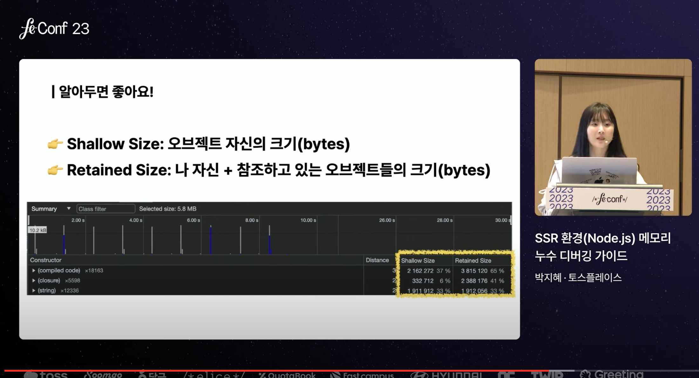

### 추가 팁: TypeScript 5.2의 `using` 키워드

using 키워드는 타입스크립트 5.2 버전에서 생성. 
let, const, var 대신 using 으로 변수를 선언하면, 변수 선언 안에서 Symbol.dispose() 만들어 두면, 호출이 됨. (여기에 뭘 넣는 거에 따라서 클린업을 할 수 있습니다.)

## 6. 요약 및 Best Practices

- 서버 환경과 클라이언트 환경으로 나눠서 디버깅하자.
- 서버 환경에서는 node --inspect 옵션을 쓰자.
- timeline 으로 힙메모리 사용량을 프로파일링하는 것이 유용하다.
- Shallow Size 대비 Retained Size 가 큰 객체를 찾가.
- using 잘 쓰면 덜 고통스러울수도! 

