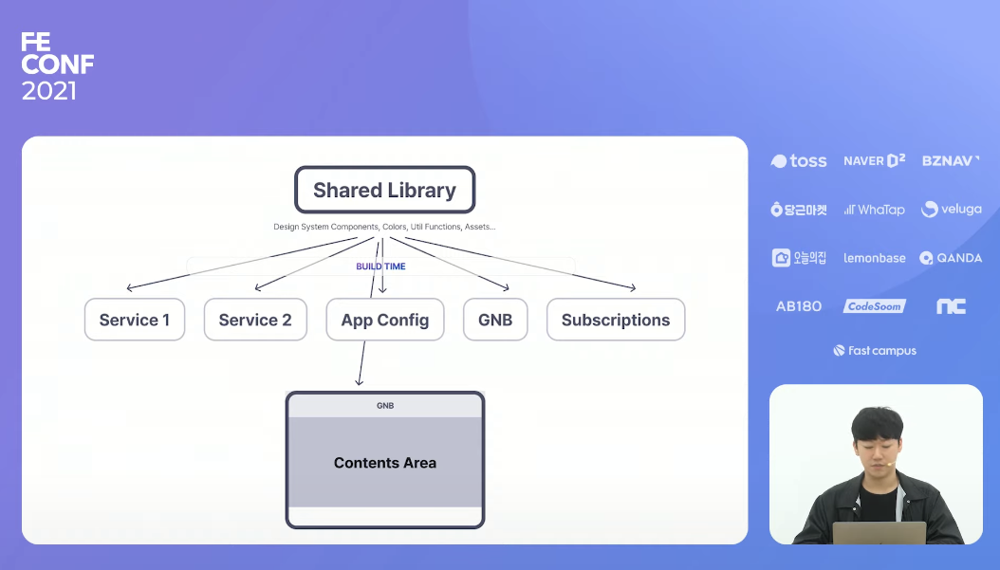
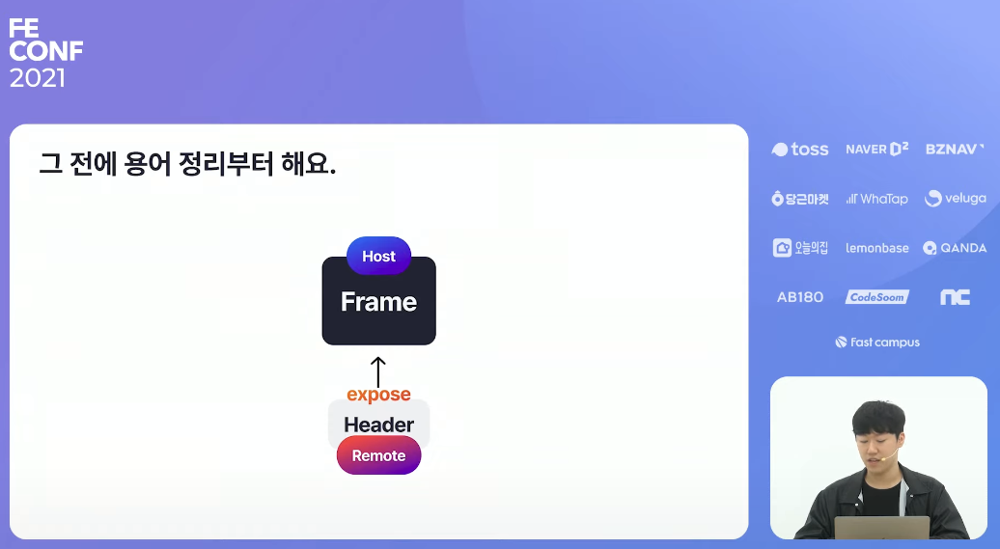
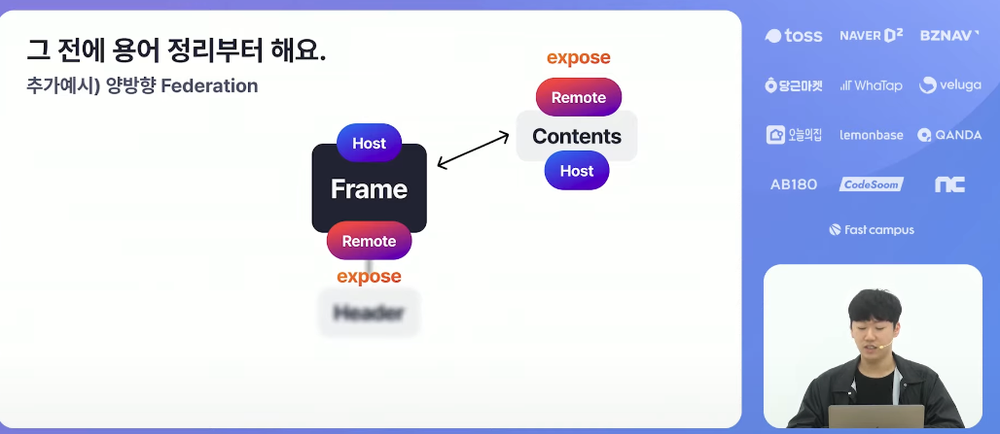

# Webpack 5 Module Federation으로 Micro-Frontends 운영하기

[Webpack 5 Module Federation으로 Micro-Frontends 운영하기][https://www.youtube.com/watch?v=0Eq6evGKJ68]

## 발표 : 임지훈

-> 하나의 앱에 10개 서비스를 운영할 정도로 서비스가 큽니다. 

## 기존 아키텍처의 문제점 

하나의 패키지에 모든 기능들이 포함된 비즈넵 모바일의 모놀리식 구조.
모놀리식 패키지구조가 어떤 영향을 미쳤는 지 알아봅시다.


특정 피쳐에 버그가 발생할 수 있습니다.
-> 다른 피쳐에서 문제가 발생합니다. 

발생하는 문제점.

1. 서로 의존하고 있는 피쳐들 사이에 발생한 문제의 원인이 어디에 있는 지 파악하기 힘듭니다.
2. 특정 피쳐에 새로운 것을 추가하거나 기존 코드를 수정했을 떄 의존성을 가지는 다른 피쳐에서 문제가 발생할 수 있습니다.


## 비효율적인 빌드 및 배포

버그 발생 / 서버 인터페이스 변경 대응 등으로 인해 코드 수정이 발생했을 떄.
`변경되지 않은 코드들도 번들에 포함되어 같이 빌드 됩니다.` -> 빌드 시간만 수십분...


앞서 문제점들을 해결할려면?

- 스크럼별 독립적인 개발 및 배포.
- 다른 피쳐에 영향받지 않은 독립 패키지.
- 단일 비지니스 로직을 여러 환경에서 사용하기.

이러한 문제점들을 해결하기 위해 - Micro-Frontends Architecture 를 도입했습니다.
`독립적으로 운영 및 개발이 가능한 프론트엔드 애플리케이션들로 더 큰 하나의 전체 애플리케이션을 구성하는 아키텍쳐.`

`독립적인 서비스는 - 독립적 빌드, 테스트, 배포 됩니다.`
최종적으로 개발된 애플리케이션들은 하나의 Production 으로 합치게 됩니다.

개발자 입장에서는 독립적으로 볼 수 있지만, 유저 입장에서는 하나의 프로덕트를 사용 합니다.

Micro-Frontends 를 구현하기 위해 고려했던 방법들.

1. Build-Time Integration -> `결국 수정사항을 반영하기 위해 모든 패키지들을 다시 수십분을 거쳐 빌드해야 하고 배포해야 하는 프로세스는 동일합니다, 제외함`
   
2. Run-Time Native WebView Integration

    Native Mobile App WebView && WebApp 
    - 가장 이상적으로 생각되는 통합 방식.
    - 하지만, 네이티브 개발 인력을 구하기가 어려움.
    - 초기 개발 공수가 상당히 큼.
    - 제외


3. Run-Time Bundle iframe Integration `using iframe`

    - 보안, 성능, 안정성 이슈.
    - 앱 간의 통신 인터페이스를 구현해야 함 (postMessage)
    - 딥링크나 라우팅에 대한 고민. 

    


4. Run-Time Bundle Integration

자바스크립트를 통한 번들 통합.
이 방식은 앱의 최상단에서 빌드된 것들을 다운로드. 

이러한 번들들을 각각 상태를 등록.
최상단에 라우터를 만들어서 동적으로 렌더링 합니다. -> single-spa, Webpack 5 Module Federation

``` javascript
<script src="https://mfe.bznav.com/app1_bundle.js">
<script src="https://mfe.bznav.com/app2_bundle.js">
<script src="https://mfe.bznav.com/app3_bundle.js">
-> init(window.mf.app1);
-> route = {
    '/app1': () => run(window.mf.app1)
    '/app2': () => run(window.mf.app2)
    '/app3': () => run(window.mf.app3)
}
```


## Module Federation에 주목하다.

Module Federation은 런타임에 통합된 각 애플리케이션들이 서로 `코드를 공유합니다.`

Module Federation의 특징.


첫 번쨰 - UI Component 

Business Logic, State, JSON, Assets, Styles 모두 공유 할 수 있습니다. 
Webpack 이 처리할 수 있는 모든 형태를 Federate 할 수 있습니다.


두 번쨰 - Any Javascript Runtimes 
모든 애플리케이션 환경을 Module Federation 으로 구성한다면? 

Shared Library (Design System Components, Colors, Util Functions, Assets ...) -> 안정성을 위해서 통합 시키기.
Remotes (Service1, Service2, App Config, GNB, Subscriptions 통합되는 부분)
Host (GNB, Contents Area 통합되어 사용)



요약 : 독립적인 특정 애플리케이션에 있는 코드들을 모듈이라는 단위로서 다른 애플리케이션에 공유하고 또 공유 받을 수 잇는 기능.
런타임에서 코드를 공유하는 것의 가장 큰 의미 -> `배포된 코드가 실시간으로 반영됩니다.`


## 코드를 통해 이해하기.

1. WebPack 5 환경.
2. Webpack 설정을 커스터마이징할 수 있는 환경

Header, Frame 환경을 만들기.
Header 앱이 Frame 앱에 통합되는 환경을 만들어 봅시다.



Header -> Frame <-> Contents 


