# Do more, with less. - Design system. What't next? 

[디자인 시스템, 그 다음은?](https://www.youtube.com/watch?v=LmLchZ4tCXc&t=2670s)

<h2>디자인 시스템, 그 다음은?</h2>

## : 발표 : 이병철 UX Engineer @toss 

이야기 할 내용

- UI 개발의 일반적 문제 (`해결책은 -> 디자인 시스템`) 

- 디자인 시스템 도입 후 생기는 문제 
  
    1. 코드를 디자인에 일치시키는 어려움.
    2. 소통의 어려움
    3. 엄격함과 유연함 사이의 어려움.

`디자인과 개발 사이의 고민하는 분들에게 이 발표가 도움이 됩니다.`

### UI 개발의 일반적인 문제

토스 뱅크 버튼마다 색이 다르고, 텍스트 크기도 다릅니다.
분명 하나의 앱인데 다른 서비스 처럼 보입니다. 

왜? 버튼이 다 다르냐?
padding, 텍스트 크기 - 디자이너, 개발자가 매번 새로 개발했기 떄문에 달려졌습니다.
동작도 다르고, 버그도 다르고, 유지보수도 어렵습니다. - 팀에 생상성이 점점 떨어집니다.

디자이너 수가 많아지고 팀의 규모가 커지면, 디자이너들 끼리 공유하기 힘들어서 
`디자이너 시안을 받은 개발자분들은 또 각각 컴포넌트들을 개발하게 됩니다.`

매번 새롭게 만드는 일이 빈번하게 일어납니다.

 
 
 

### UI 개발 플로우

 

코드들을 막 뒤지면서 찾아보고
`사이즈 여백 폰트 다 일치한다 싶음?` -> 재활용 -> `디자이너 의도와 같고 UI 의도가 같으면` -> 코드 재활용.
아님 코드 새로 만듬.

코드 뒤져서 비슷한 코드를 찾느니 -> `새로 짜겠다.(자기만의 컴포넌트)`
`유지보수가 어려운 UI 코드` -> 중복 코드, 파편화 증가 -> 디자인 일관성 떨어집니다.

이것을 해결하기 위해 생겨난 것이 -> `디자인 시스템.`

버튼의 의도를 생각하면 : `클릭하면 눌리고 어떤 액션을 실행하는 UI`
디자이너마다 각기 다른 버튼 `(폰트 사이즈, 여백) 의도는 같지만,` 다른 사람이 만들다 보니 버튼의 상이 다르고, 디자인도 다릅니다.

만약 3개의 버튼을 각 디자이너 3명이 만들었다 하면 -> `각 다른 버튼 3개가 생성됩니다.`

비주얼 언어 - `컬러 토큰 (제품에 만드는 컬러를 생성)`

- 타이포그래피 토큰
- 사이즈 토큰
- 여백 토큰
- 트랜지션 토큰

토큰 단계 다음으로 만드는 것이 컴포넌트.
컴포넌트 생김새나 동작을 정리합니다.

토스팀 예로 ) `Primary fill, Dark fill, Danger fill, Light fill 
fill` 과 weak 로 버튼을 또 구분합니다.

 
 

Normal, Pressed, Disabled, Loading - 비주얼 언어. 

각 만들어진 버튼들을 - 컴포넌트라 부릅니다.

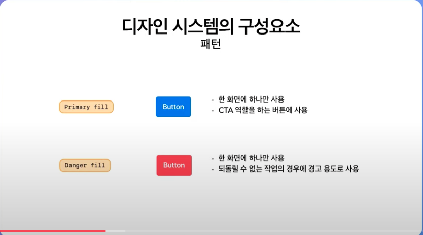

버튼을 몇가지 옵션으로 제약함으로, 디자인이 몇가지 옵션으로 만들어지고, 재사용 가능한 기회를 만들어냅니다.
`컴포넌트 다음으로 패턴이라는 것이 등장합니다.`

패턴은 사용처를 제약합니다.

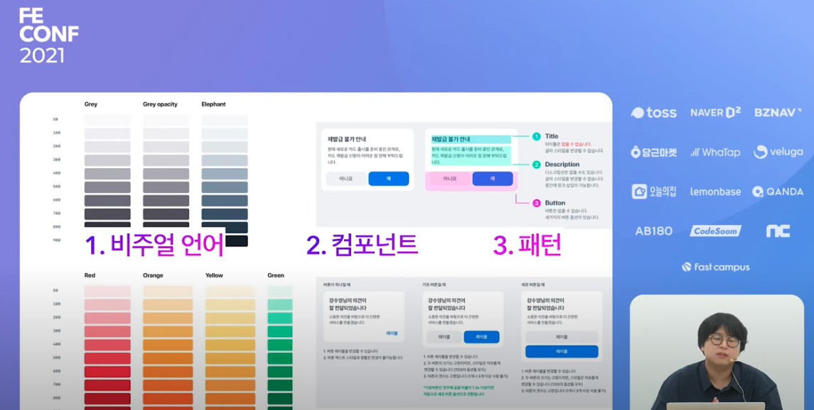

1. 비주얼 언어 -> 2. 컴포넌트 -> 3. 패턴 

 

이 `UI 구조가 디자인하기 위한 문법 언어처럼 보여서` 비슷한 개념을 두고 디자인 language, `디자인 시스템`이라고 부릅니다.

 

`디자인 시스템을 구축하면 개발에서도 똑같은 컴포넌트들을 라이브러리화 하기 떄문에, 라이브러리에서도 반영 됩니다.(Storybook)` 

디자인 시스템에 스펙대로 `디자인 버튼`, `개발 버튼`.
버튼에 대해 상세 스펙 논의 x
`버튼에 간단히 설명하면 커뮤니케이션이 필요 없이 결과물 구현.`

 
 
 
 

### UI 개발 플로우 

 

`디자인 시스템을 만든 다음은 플로우가 아주 간결 해 집니다.`
 
 

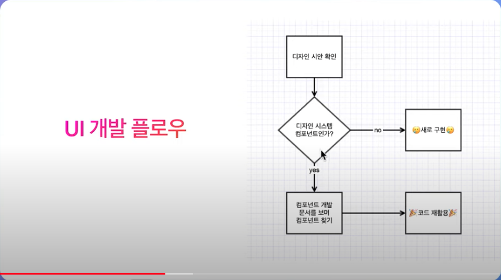

 

디자인이 모든 것을 해결 해 주었나요?

`디자인 시스템은 적어도 앞선 문제들을 해결 해 주었습니다. 코드를 디자인에 일치하는 어려움이 있습니다.`

 
 
 

### 첫번쨰 문제 디자이너, 개발자가 각자 다른 컴포넌트를 구현하다 보니 디자인 의도와 다른 결과물이 생성됩니다.

 

디자인 툴에서는 동적인 것들을 만들지 못하므로.

예) 버튼의 텍스트가 길어지면 버튼 정렬이 세로로 변경.

- 코드로만 구현이 가능.
- 스케치 같은 디자인 툴에서는 확인 불가. 

 
 

### 두 번쨰 문제 : `서로 다른 언어를 원합니다. (소통의 어려움)`

`비주얼 중심의 디자인 언어 !== 기능 중심의 개발자 언어 `

 

`디자인 시스템을 쓰면 소통이 더 쉬워지는 것이 아닌가?`
떄떄로 버튼을 예로 들면 버튼 4가지 속성 중 하나 선택.
인자값(Type)으로는 - `블루(primary), 다크(danger), 레드(light), 라이트(dark)`

디자이너들은 색상 이름 자체로 소통.
개발자와 소통 할 떄는 블루, 다크, 레드, 

블루는 - `primary 더 복잡할 수록 개발자 언어로 표현해주는 것이 어려움이 있습니다.`

 
 

### 세 번쨰 문제 : 엄격함과 유연함 사이의 어려움.

 
 

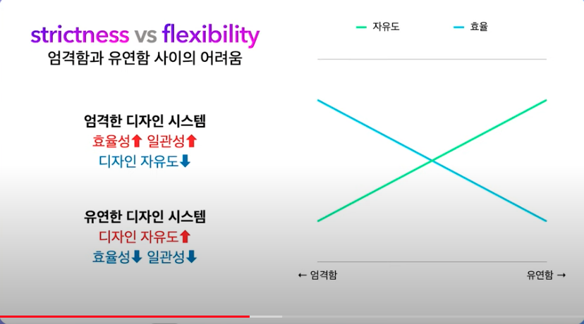

엄격한 디자인 시스템 일 수록 - 효율성 증가, 일관성은 감소, 디자인 자유도 감소.  
유연한 디자인 시스템 일 수록 - 효율성 감소, 일관성 감소, 디자인 자유도 증가.

디자인 시스템 가이드 -> 디자인(스케치 컴포넌트) -> 디자인 시안.
디자인 시스템 가이드 -> 개발(React 라이브러리) -> 구현 결과물.

디자인과 코드 사이에 의존 관계를 만들 수 있을까? 

기존 디자인 툴의 한계
- 스티커 붙이기 툴

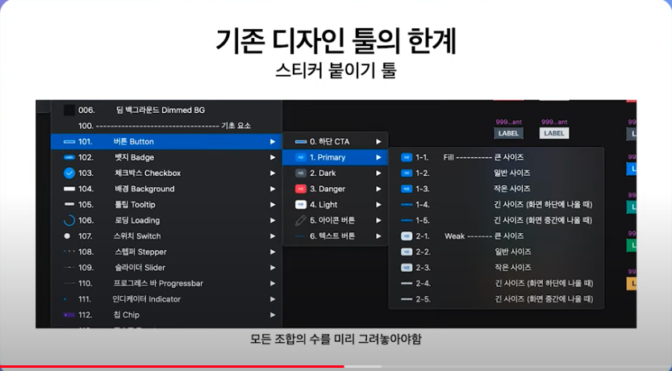

`동적인 상태도 어렵기 떄문에,
다이얼로그에 버튼이 바뀌는 구현하기 어려운 동작.`

디자인 툴에서도 코드를 사용할 수 있으면 좋을텐데.
Framer : React 기반의 프로토타이핑 도구까지 있습니다.

피그마와 크게 다르진 않습니다.
하지만 디자인 툴과 차이는 프레이머는 모든 요소가 리액트 컴포넌트로 이뤄져 있습니다.

 
 

### Code Component 기능.

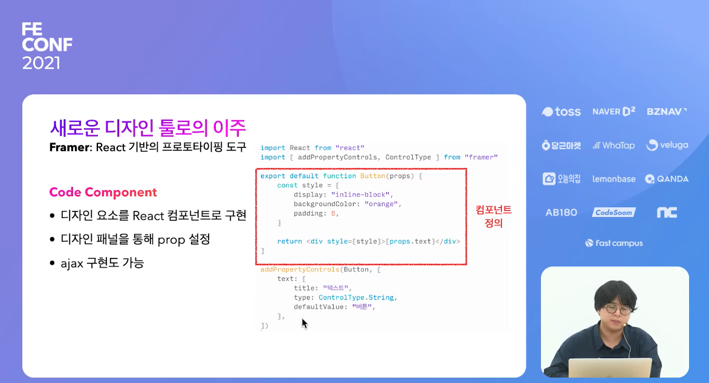

 
 

div 안에 text 렌더하는 컴포넌트.
addPropertyControls 로 string 타입 추가를 해 주었습니다.

- 디자인 패널 정의 (props) 

`React 로 작성되어 있던 디자인 시스템을 다 Framer 로 옮겼습니다.
반응형 디자인 시안, 여러 휴데폰 기능들이 있어 하나하나 반응형으로 볼 수 있습니다.`

기존 Hand-off 도구 (제플린) 에서 컴포넌트 표현의 어려움.
토스에서도 제플린으로 디자인 시스템.

제플린으로 UI 개발 하다보면 번거로운 일이 있습니다.
디자인 시스템 컴포넌트 확인하는 일.

어디까지가 디자인 시스템이고, 어디까지가 디자이너가 만든 것인지 하나하나 클릭 해보고 확인 해 봐야 알 수 있었습니다.

`손가락 이미지가 디자인 시스템으로 이뤄짐.`

 
 

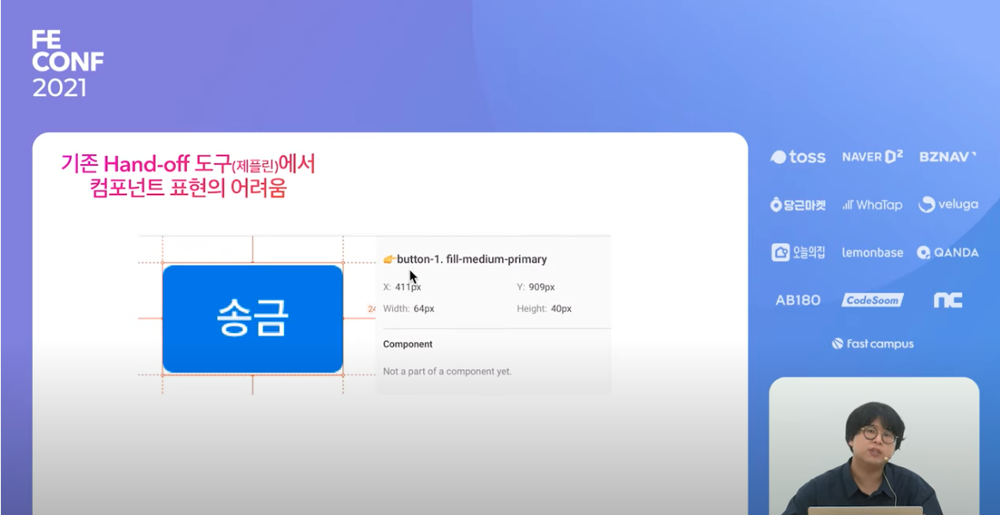

 
 

`개발자들은 레이어 이름을 보고 컴포넌트 속성을 유추해서 개발 하고 있었습니다.`

예를 들어 AmountTop 더 복잡한 컴포넌트,
`그런 경우 버튼처럼 레이어로 만들기 어렵습니다.`

타이틀과, 서브 타이틀, 버튼 `3가지 요소로 구성된 하나의 컴포넌트.`
하나하나 레이어 이름을 확인하고 개발을 해야 합니다.

만약 버튼을 클릭했는데 어 디자인 시스템 컴포넌트네?
`AmountTop 인지, 커스텀 UI 인 지 알 수 없습니다.`

디자인을 보고 개발한다?
`리액트 코드로 옮기기 위해서 리액트로 하나하나 컴포넌트를 다시 개발해야 하는 가?`

`제플린이든, 피그마든 기본 핸드오프 디자인 시스템을 만드는 것은 한계가 있었습니다.`

 
 
 

### 자체 핸드오프 개발하기.

- 기존 툴의 한계 뛰어넘기.

`모든 디자인 시스템에 data attributes 로 컴포넌트 정보 삽입하기.
data-tds-type 이 지정된 경우에만 선택 가능합니다.`

 
 

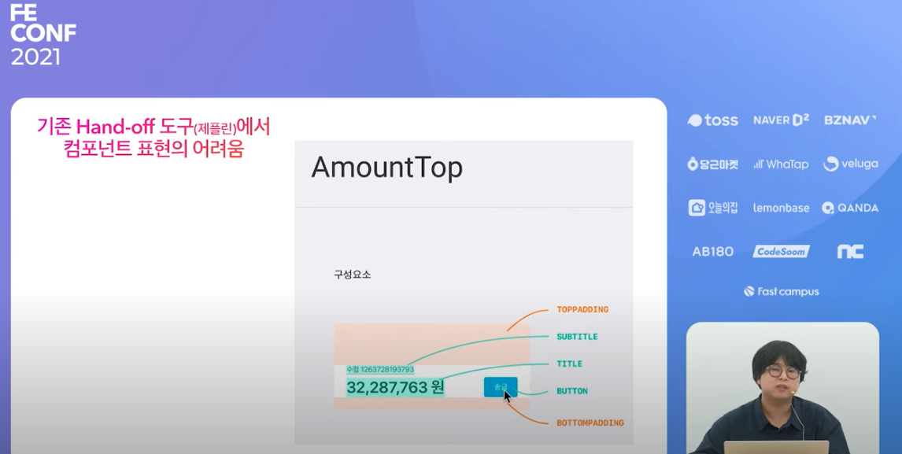

 
 

여러 가지 컴포넌트 개발에 필요한 속성들이 나오게 되었습니다.

 
 

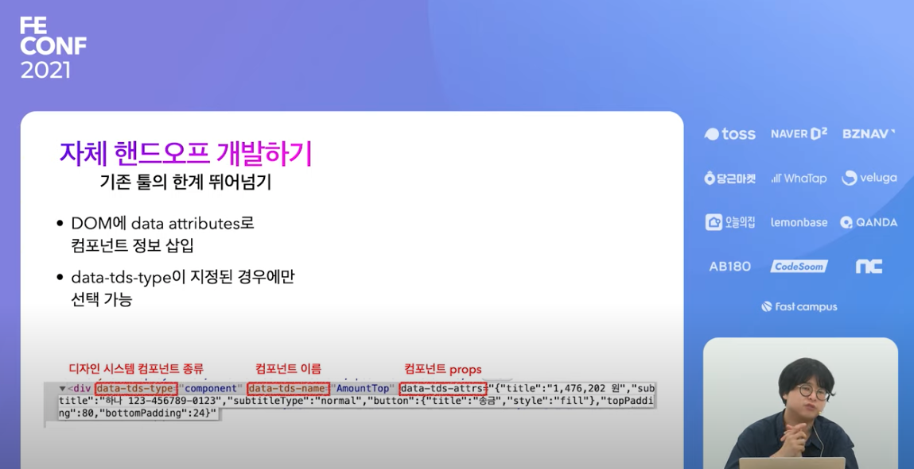

 
 

그리고 디자이너 색상이름과, 개발자의 색상 기능 이름이 서로 달라서 소통하기 어려웠는데,
이런 것들도 해결 하게 되었습니다.

 
 

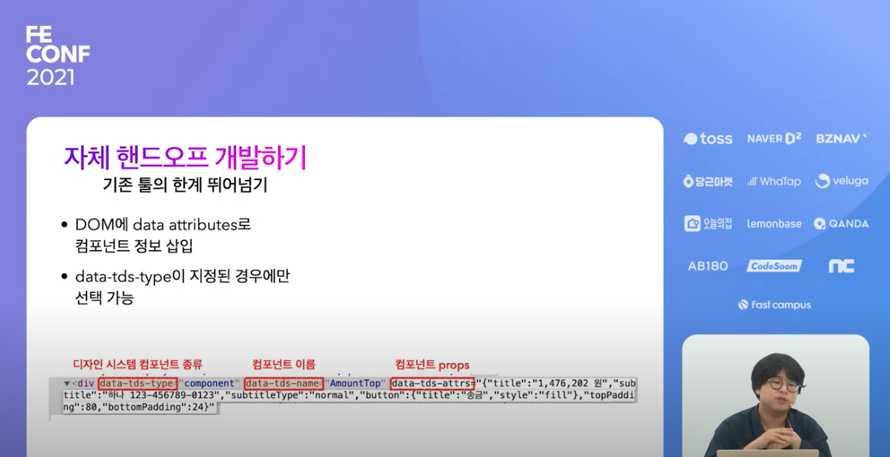

 
 

핸드오프 기능을 만들고 나니, `엉청난 편리함을 만들 수 있지 않을까? 생각 했습니다.`
그리고 생겨난 것이 `Design Syntax Tree(DST)`

 
 

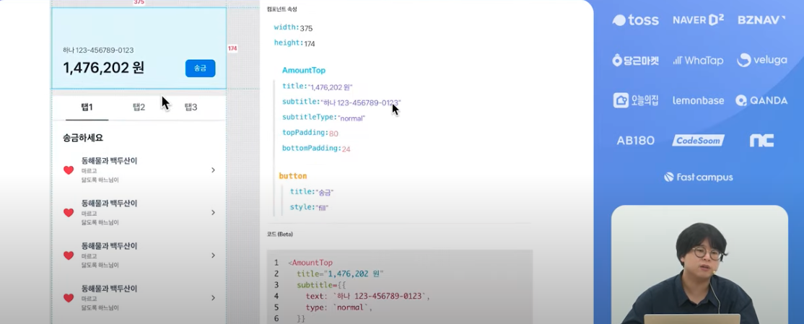

 
 

`하단에 고정되어 있는 버튼을 자주 쓰는 데, Overlay 그룹 안에 FixedButtonCTA 로 구성되어 있습니다.
DST 각 노드를 표현하고 있습니다.`

AmountTop 은 텍스트 2가지 버튼 1가지로 구성되어 있습니다.

 
 

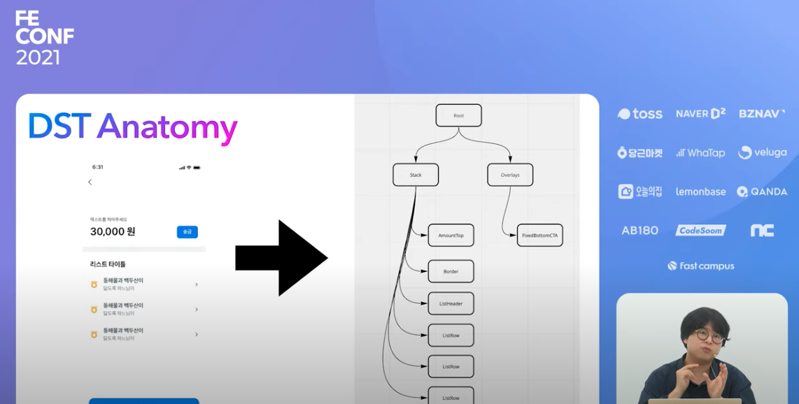

 
 

디자이너가 디자인 패널을 통해 입력하면, `DST` 로 바로 번역이 됩니다. 
`React DST Renderer 에서는 실제로 ReactNode 를 렌더링 하게 됩니다.`

DST 가 디자인 구조화하기 떄문에,
개발자가 디자인을 직접 해석해서 컴포넌트로 옮기는 작업을 자동화 시킬 수 있습니다.

 
 

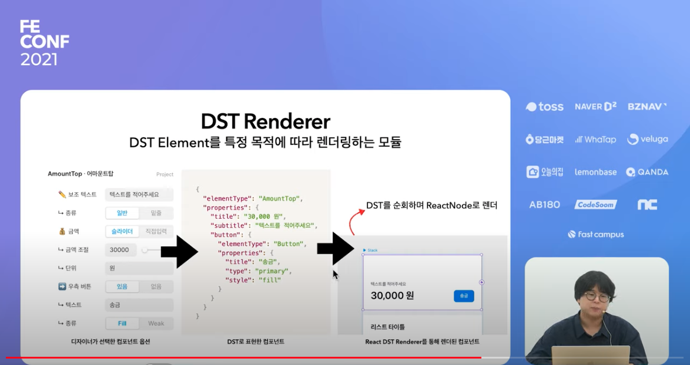

 
 

`그러면 엄격함과 유연함 사이의 어려움은 어떻게 해결 할 수 있을까요?` 
엄격한 디자인 시스템의 장점.

디자인의 제약 -> `UI 파편화 감소` -> `디자인 재사용률 증가` -> `유지보수 포인트 감소` -> `개발 생산성 증가.`

엄격함 대신 유연함(구멍)이 필요할 떄.

- 디자인 시스템이 효율적이긴 하지만, 제품을 위한 최고의 디자인은 아닙니다.
- 패턴 가이드에 벗어나는 UI 를 실험할 떄. 

 
 

디자인 시스템의 구멍이 넘나드는 이유.

1. 디자인 시스템에 컴포넌트가 있는 줄 모름.
2. 구멍인 줄은 알았는데, 자유롭게 쓰고 싶었습니다.
3. 컴포넌트를 쓰긴 했는 데, 패턴을 어긴지 몰랐습니다.
4. = 개발 생산성의 저하.

엄격한과 유연함 사이의 균형 맞추는 것이 매우 중요합니다.

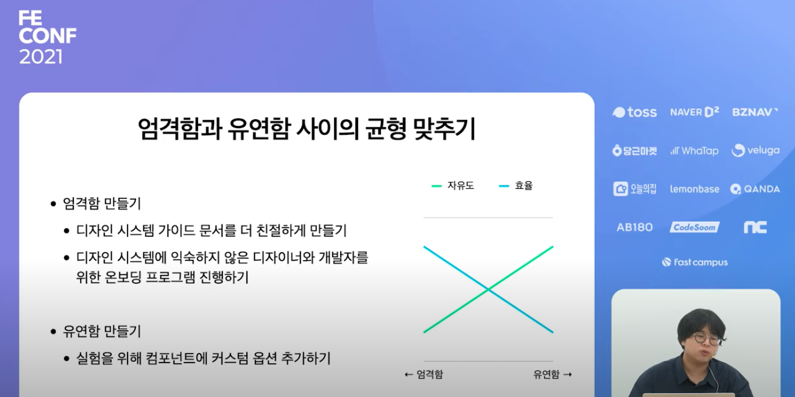

디자인 시스템을 활용해 같은 의도를 표현하기 만 해도.
디자인 시스템을 잘 만들어도 안 쓰면 말짱 도루묵

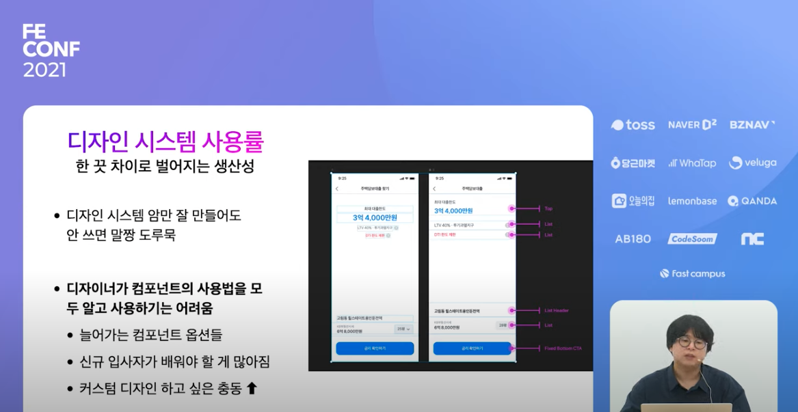

디자인 시스템 Coverage 계산기.

- 디자인 시스템 더 잘 사용하게 넛지.

디자인이 권장 패턴에 맞게 만들어졌는지 실시간으로 체크해주면 어떨까?
DST 를 이용해 디자인을 분석 -> 안티 패턴인 경우를 알 수 있게 함.

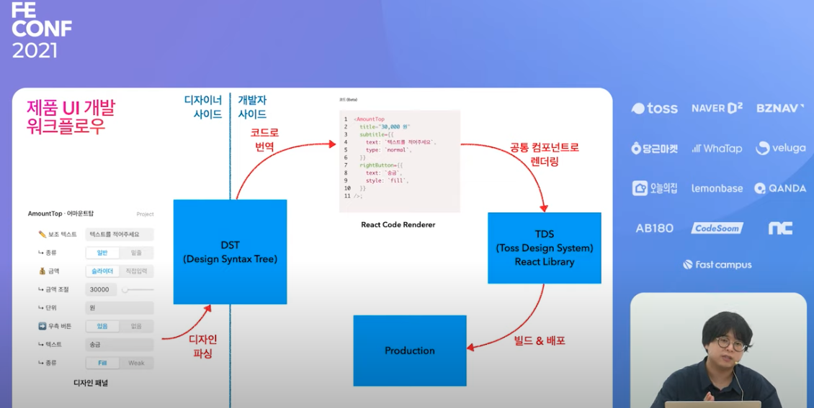

토스 팀에서는 토스 디자인 시스템 라이브러리 TDS 를 구축해서  
직접 내부에서 디자인 시스템을 잘 사용 할 수 있도록 구축 했다고 합니다.
