# 디자인 시스템, 형태를 넘어서

[디자인 시스템, 형태를 넘어서](https://www.youtube.com/watch?v=21eiJc90ggo)

<h2>디자인 시스템, 형태를 넘어서</h2>

## 발표 : flex - 이소영 

여러 가지 옵션 중 선택 할 수 있는 Select 컴포넌트.
다양한 형태로 표현 할 수 있습니다.

{ 형태 }  -> 사물의 생김새나 모양.
`명사` : 컴포넌트의 생김새나 모양.

`스타일, 형태, 커스텀, 제약`
단순히 옵션 모양을 보여주고 Select 컴포넌트도 다양한 부분에 대한 커스텀이 필요해질 수 있습니다.

보통 이것을 어떻게 대응하고 있었을까?

2가지 방법 또오름.

1. 하나의 Select 컴포넌트의 그떄 그떄 Select 크게 만들어 가는 방식.
2. 각 요구 사항을 나누어서 여러 가지의 Select 컴포넌트를 만들어 가는 방식.
-> 두 가지 방식모두 아쉬움.

1. Props 를 늘려가는 방법은 -> 디자인 시스템 책임이 무거워 지고, 복잡성 증가.
2. 여러 구현체가 흩어지다 보니 파편화와 복잡성이 증가할 수 있습니다.
-> 이런 식으로 디자인 시스템이 커지다 보면, 더 복잡하고 어려지고 Product 개발에 어려움을 느낄 수 있습니다.

개발자는 디자인 시스템을 사용할 떄 어떤 것을 기대하고 사용 할까?
디자인은 디자인 시스템을 개발해 만들고 어떤 생각을 가지고 사용을 할까?

형태 - 기능 - 접근성 - 커스텀 

형태 (기본 스타일) color, layout, weight (...)
기능 (컴포넌트가 수행해야 하는 동작) 
접근성 (popup 요소에 대한 힌트, 키보드 탐색 힌트) 
커스텀 (다양한 예제에 대응하려면 컴포넌트 레벨에서 형태, 기능 쉽게 커스텀 할 수 있는 방법을 정의하고 제공해 주어야 합니다.

형태 (기본 스타일), 기능, 접근성, 커스텀.

예를 들어 Select 컴포넌트 처럼 기본 형태 즉 스타일을 정의 한다면,
Custom 이 가능하더라도 형태가 존재하지 않더라도 일부 졔약이 생길 수 있음.

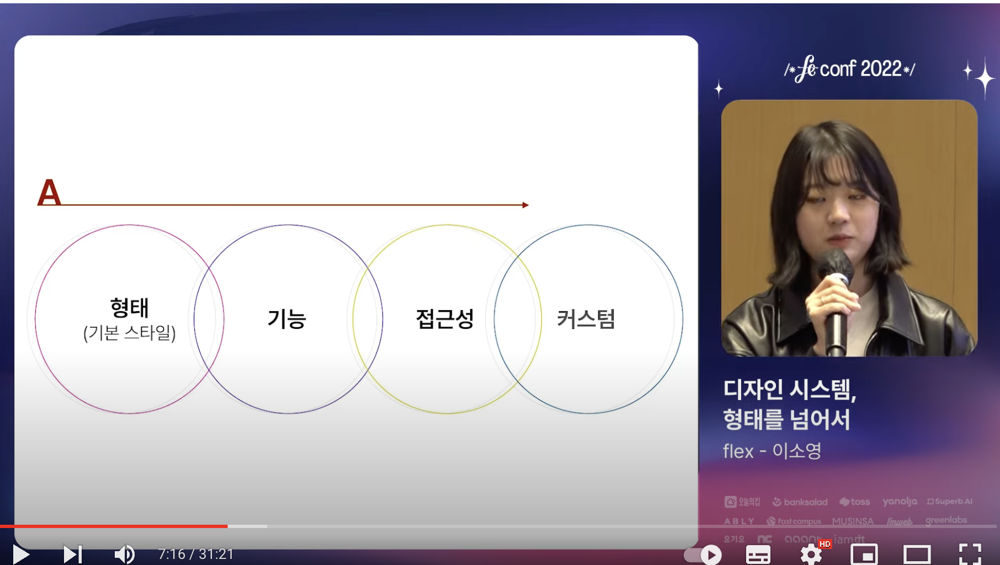


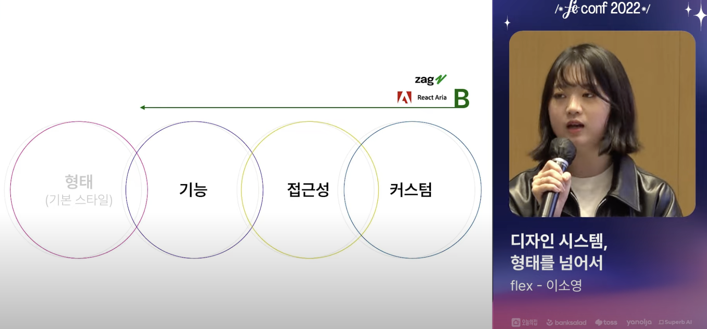

형태를 자유롭지 않으면 자유롭지만 형태를 매번 정의 해야 함. (Zag, React Aria)
컴포넌트를 제공하는 것이 아니라 동작 Hook을 제공합니다.

기본 형태를 정의하면서, 앞서 소개한 디자인 시스템이 겪는 어려움을 어떻게 해결 할 수 있는지.
Flex 디자인 시스템인 linear 를 설명하겠습니다.

FDS 1.0 (일관성이 부족한 props, 접근성, 기능 지원 부족)
FDS 2.0 (형태 커스텀 불가능, 키보드 지원 안됨 Ant Design)
linear 


Linear Design System (Principles)

1. 기능은 형태와 독립적이다. (형태 (style), 기능 (컴포넌트가 수행해야 하는 기능)) 

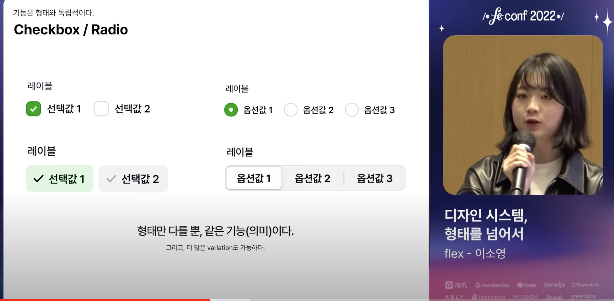

Trigger Component 드롭다운, Select 컴포넌트 같이 일정 영역을 끄고 닫을 수 있는 컴포넌트.

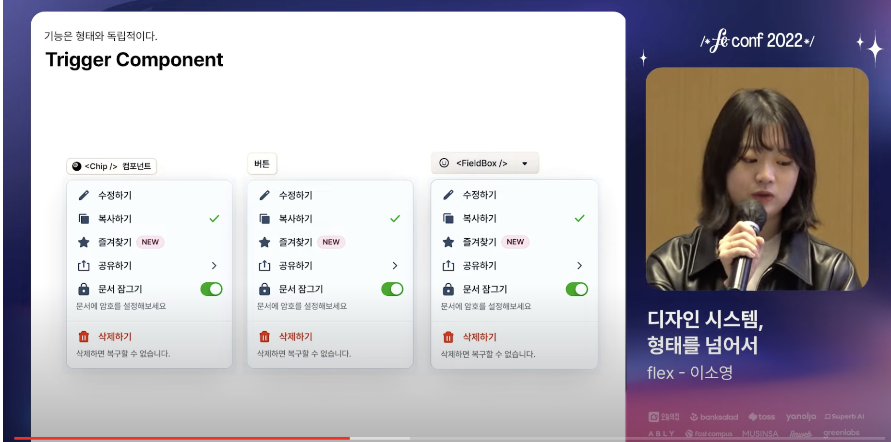


2. 기본동작을 보장한다.

많은 기본 기능. 
적은 기본 기능.

Scroll 영역.
-> Modal 컴포넌트에 모달을 사용할 떄 sroll 영역 기본 제공되어야 합니다.

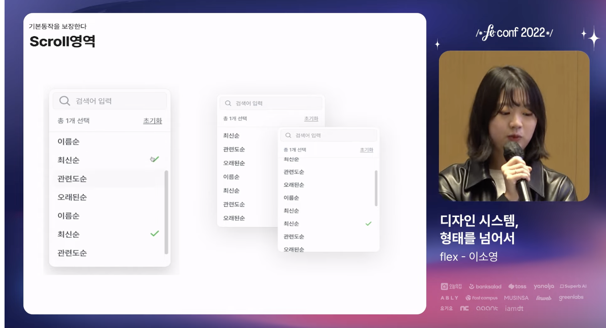

접근성 

모달 설명하는 요소를 제공하고, 개발자가 신경써도 않아도, 스크린리더에서 제공해 줍니다.
Select 탐색 기능과 접근성 속성도 내부에 필요한 roll과 프로퍼티를 제공해주고 컴포넌트를 사용하기만 하는 방식으로 사용.


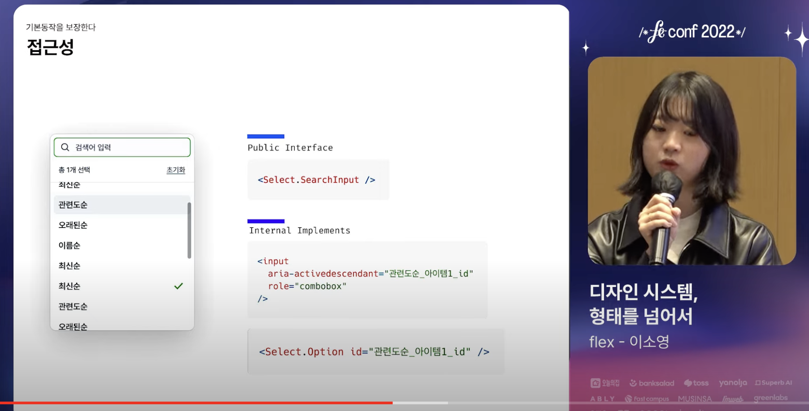


`기본기능이 아닌 것은 정의 하지 않는다.`
완성형 set 이 아닌, 조합형 컴포넌트.

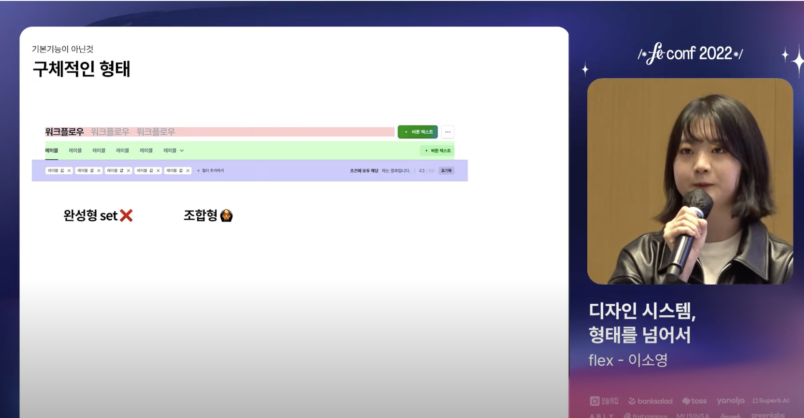


3. 최소한의 제약만 가진다.

Linear 의 지향점.
-> 최대한 자유도 보장, 프로덕트 디자이너들이 제품을 디자인함에 있어 제약없이 최고의 경험을 설계하는 데 집중하도록 합니다.
다만, 디자이너의 관점에서 '이상하다'고 느낄 수 있는 사항들은 제약합니다.

모달 컴포넌트들의 사용 예시

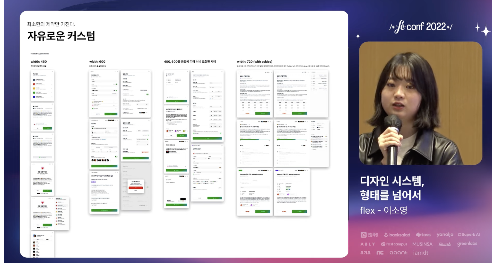

List 컴포넌트 역시 Modal 과 비슷하게 다양한 방식으로 사용 될 수 있습니다.

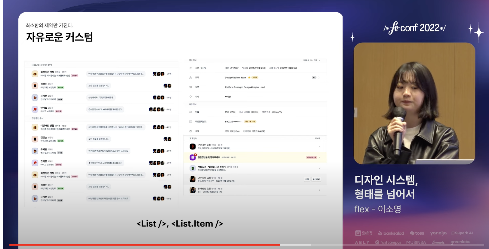

모든 케이스를 List, List.Item 에서 정의할 수 없습니다.


## 소개한 Principle 설명하고 어떻게 구현했는 지

Checkbox/Radio

코드 레벨에서 2가지 컴포넌트로 제공 할 수 있습니다.


``` javascript
<RadioGroup>
    <RadioGroup.Item />
    <Text>선택값 1</Text>
</RadioGroup>
```

``` javascript
<RadioGroupPrimitive.Root>
    <RadioGroupPrimitive.Item>
        <Box>선택값 1</Box>
    </RadioGroupPrimitive.Item>
</RadioGroupPrimitive.Root>
```


Trigger Component 
-> 이 컴포넌트의 핵심은 Trigger 기능이 되는 노란색 기준으로 자리 잡아야 합니다.

``` javascript
<Select>
    <Select.Trigger />

    <Select.Content>
        <Select.Item />
        <Select.Group />
        <Select.Separator />
    </Select.Content>
</Select>
```


Select 컴포넌트를 포함하여 모든 기능은 필요한 동작을 수행하기 위한 Compound Component 로 구성되어 있습니다.
컴포넌트 간의 외부 상태 공유가 존재하는 것이 특징입니다.
내부에서 Context API 를 통해 공유한다는 것을 의미합니다.

Select 컴포넌트에서 <SelectProvider></SelectProvider> 를 통해 공유가 가능하도록 만들고,
SelectContent 컴포넌트에서 useSelect

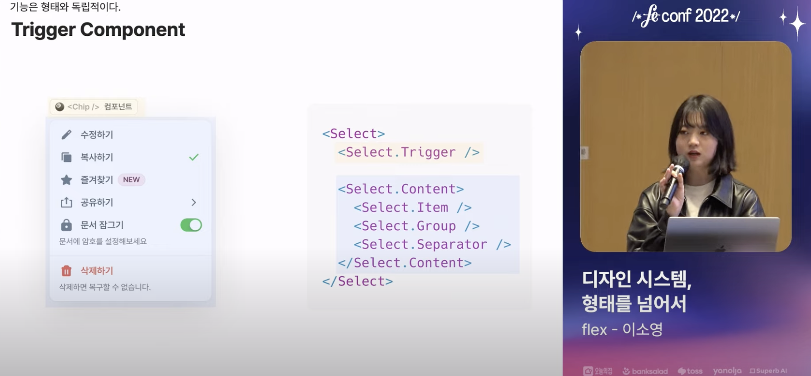
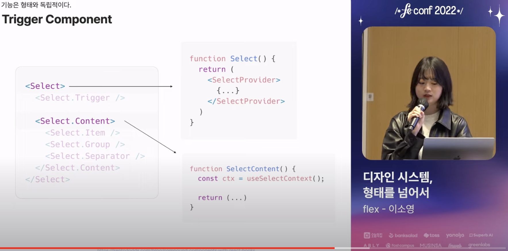


1. trigger refenecne 를 통해 context 를 통해 공유.
2. trigger 위치 기반으로 Content 위치 결정.

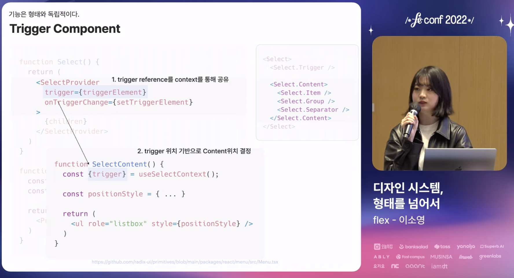


Modal Scroll 동작역시 유사하게 만들어져 있습니다.
최상의 컴포넌트가 존재하고 하위 요소로 Content toolbar 가 사용됩니다.

ModalSrollArea 에 setScrollPos -> RootContext 를 통해 공유하는 방식입니다.
하지만 -> 조합적으로 만들면 그에 따른 비효율도 증가합니다.


1. 디자인 시스템, 어떻게 `정의`할 것인가?


형태가 강하게 결합된 디자인 시스템의 문제점.
    다양한 상황을 대응할 수 없음 -> 디자인 시스템 병목이 됩니다. 

디자인 시스템을 형태/기능/접근성/커스텀 4가지 구성 정의합니다.

flex design system linear -> Primitive Component
    컴포넌트의 기능은 형태와 독립적이어야 한다.
    기본 동작을 보장한다.
    최소한의 제약만 정의합니다.

Primtive Component 의 문제점.
    조합에 대한 비효율 

    