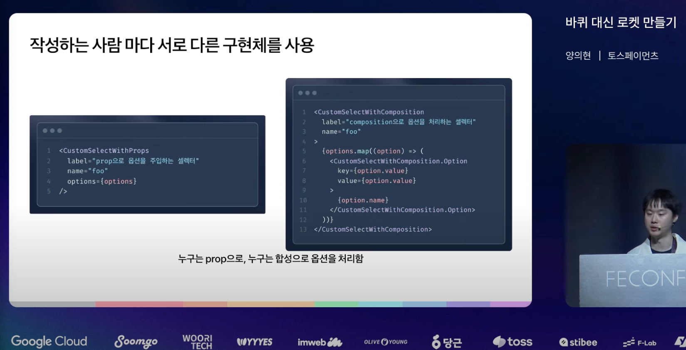
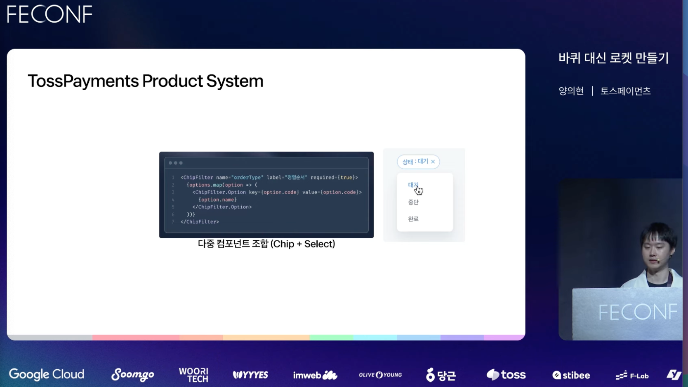
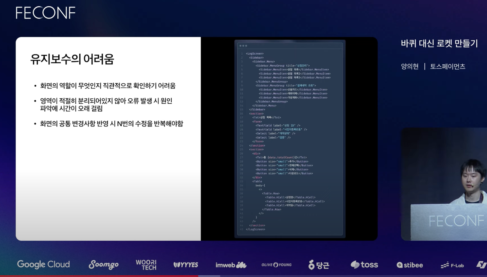
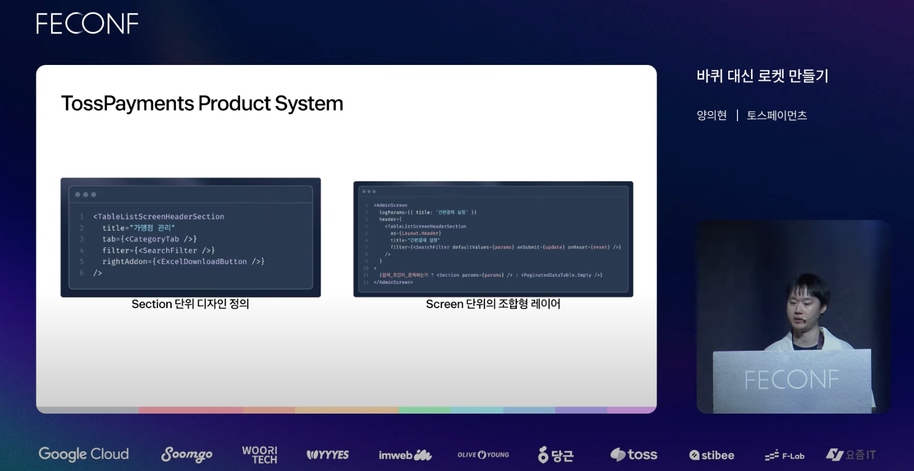
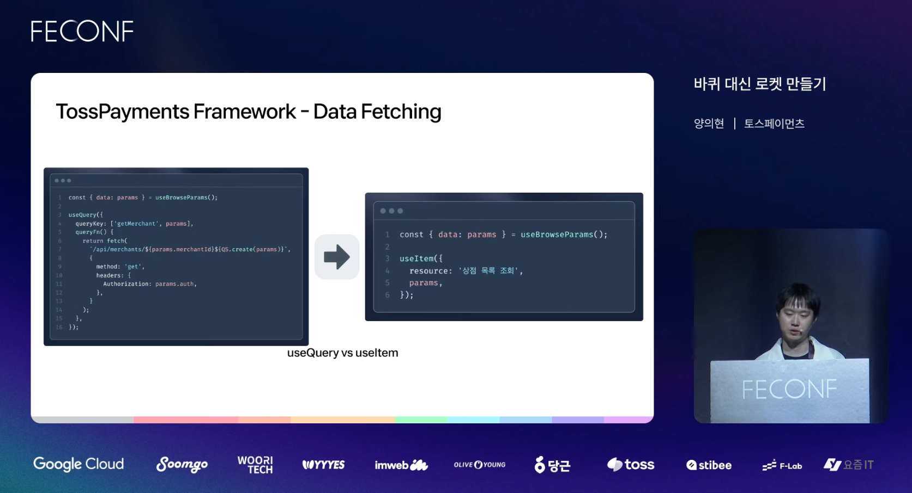
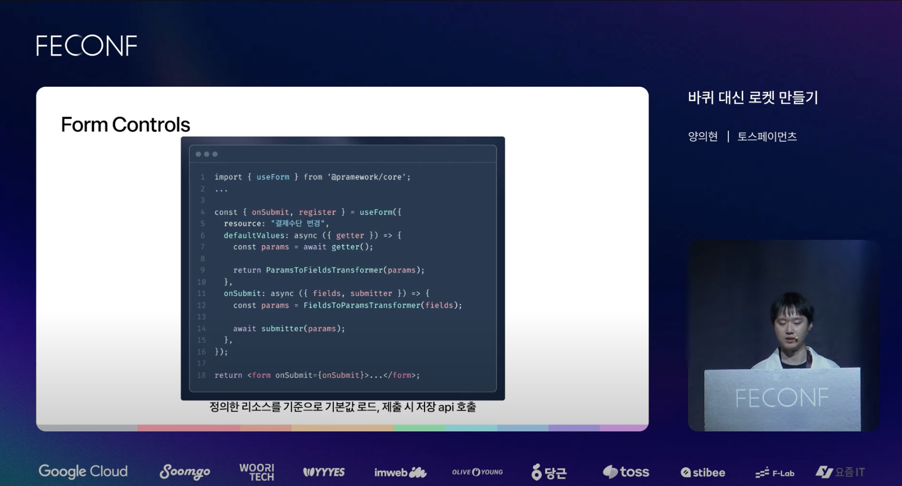
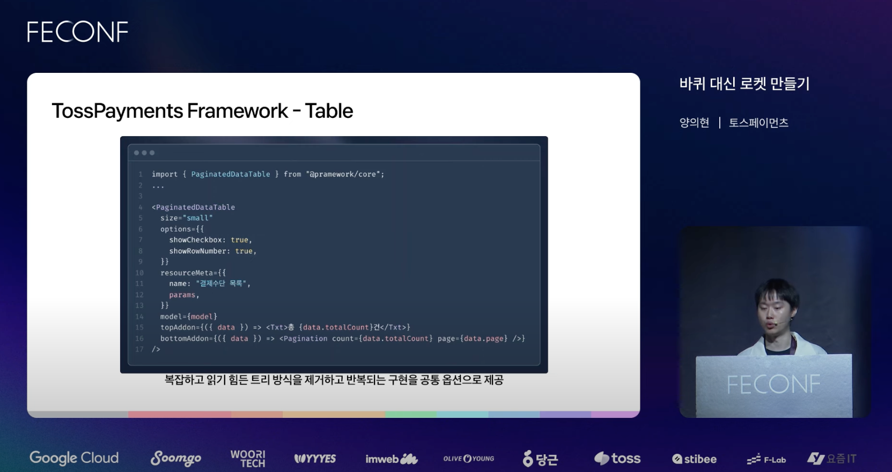
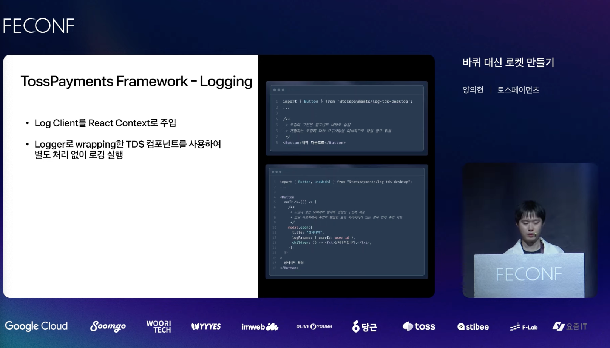

# FEConf 2024 [B1] 바퀴 대신 로켓 만들기

[FEConf 2024 [B1] 바퀴 대신 로켓 만들기](https://www.youtube.com/watch?v=B7hhxG1qUf8&t=1766s)

## 발표 : 양의현

#### 회사 배경

- 토스페이먼트는 5년 정도 된 신생 기업이지만, LG U+와 데이콤의 전통을 이어받음
- PG(Payment Gateway) 업계에서 30년 이상의 역사를 가짐
- 토스페이먼트로 인수된 후, `많은 레거시 유산을 물려받음 (JSP, EUC-KR 등)`
- 비즈니스 발전을 위해 `레거시 시스템 개선`이 필요한 상황

#### 과제

- 400개 이상의 레거시 어드민 화면 이관 필요
- 6개월 동안 4명의 프론트엔드 개발자로 10년 이상 지속 가능한 제품 개발

#### 개발 과정의 문제점

1. 개발을 바로 시작할 수 없다?
2. 협업을 하면 커뮤니케이션 하는 시간이 많이 든다?
3. 기능 개발에 사용하는 시간이 오래 걸린다?
4. 개발을 완료한 후에도 끊임없이 유지 보수가 필요하다?

#### 프론트엔드 개발 답답 3형제

1. 디자인 프로토타입
2. 서버 API
3. 요구사항 분석

1,2,3 이 되어야지 프론트엔드 개발자가 일을 시작할 수 없음.<br/>
1,2,3 이 되어야지 시작하게 되면, 늦을 수 있다고 생각함.

## 일하는 방식을 바꿔보자

Frontend 일을 할 떄 의존 관계들 (Design, Backend, Product)

### 디자이너와의 의존성을 끝내 보기.

효율적으로 일을 하기 위해서는 디자인 프로토타입의 병목이 없어야 한다고 생각했음.

디자인 프로토타입 없이도 작업할 수 있는 Action Item은 많았음.<br/>
(예: TDS 디자인 시스템) 그러나 디자인 시스템만으로는 한계가 있었습니다. (토스의 모든 계열사가 이를 사용하고, 계열사의 모든 요구 사항을 충족해야 했습니다.)<br/>
페이먼트 니즈에 최적화된 디자인을 만드는 것이 불가능했습니다.<br/>

#### TDS(Toss Design System)

##### 장점

- 다양한 기능과 형태를 제공하는 재료로, 유연한 구조와 재사용이 용이함.

##### 단점

- 반복되는 코드가 자주 생김.
- 작성하는 사람 마다 서로 다른 구현체를 사용.
- 화면을 구성하는 제품의 코드가 늘어날 수록 구현 의도를 이해하기 어려움.

이러한 한계점을 극복하기 위해, Payments Product System을 만들기로 했습니다.<br/>
Payments 제품에 최적화된 기여, 단일 구현체를 만들기 시작했습니다.

### TossPayment Product System

##### 장점

1. 반복되는 기능과 형태를 패턴으로 정의.
2. 동일 패턴은 동일 구현체를 사용.
3. 닫힌 인터페이스로 패턴과 일치하지 않은 상황에서 사용을 방지.
4. 가장 작은 단위(컴포넌트)부터 가장 큰 영역(스크린)까지 다양한 레이어에 대응.

##### 단점

1. 상대적으로 떨엊는 유연성과 재사용성.
2. 패턴에 대한 학습 비용 발생.
3. 상대적으로 기능이 한정적임.

예를 들어 `DateRangePicker`라는 컴포넌트가 있다고 가정하면,<br/>
기존 방식에서는 코드가 너무 길어 이해하기 어렵다는 단점이 있습니다.<br/>
하지만 Product System에서는 이해하기 쉽습니다.

```typescript
<YearMonthDayRangePicker
  label="적용기간"
  size="small"
  value={[new Date(), new Date()]}
/>
```

### 작성하는 사람 마다 서로 다른 구현체를 사용



뭐가 정답이라고는 정의하기 어렵고, 개발자마다 서로 다른 구현을 하는 것도 단일 구현체, 일관성 잇도록 구현하도록 함.

디자인 시스템에서도 다중 컴포넌트 조합 경우도, Chip + Select



### 유지보수의 어려움

- 화면의 역할이 무엇인지 직관적으로 확인하기 어려움.
- 영역이 적절히 분리되어있지 않아 오류 발생 시 원인 파악에 시간이 오래 걸림
- 화면의 공통 변경사항 반영 시 N번의 수정을 반복해야 함.



예와 같이 컴포넌트가 어떤 역할을 하는 지 이해하기 어렵고, 오류가 발생했을 떄, 유효하게 봐야하는 지 원인 파악하는 데 힘듬.<br/>
이것을 해결하기 위해 다양한 레이어를 만들어서, 해결했습니다.



Section, Screen 과 같은 넓은 패턴을 만들어서 제공.<br/>
자주 반복되는 패턴이 있다면, 특정 패턴의 하면 표면에 최적화를 시켜줍니다.

## 결론

- 아토믹한 구조를 추구하기보단 구체적 맥락이 들어가더라도 반복 사용하기 좋은 형태.
- 서로 다른 인터페이스로 구현할 가능성 방지.
- 명확한 역할의 컴포넌트를 정의 해 가독성과 유지보수성 향상.
- 개발자가 패턴을 이해하고 있다면, 디자이너 도움 없이 화면 구현 가능.

### Backend 개발자와 의존성을 어떻게 끝낼 수 있을까?

- 서버 API가 완성될 때까지 기다려야 할까? 꼭 그렇지는 않음.<br/>
- 서버에 구체적인 구현이 아닌, 응답 데이터와 같은 인터페이스가 필요하기 때문.

보통 API 스펙은 Swagger, Rest Docs 문서로 전달받아 이를 바탕으로 기능을 구현하고 있습니다. 하지만 이 과정은 상당히 번거롭습니다.<br/>

1. 스펙 문서 확인
2. 스펙을 TypeScript 코드로 이관
3. Data Fetcher를 통한 메소드 호출
4. 스펙 수정(문제가 있다면 스펙 문서를 업데이트하고 반복)

이러한 피곤한 루틴을 줄이기 위해 OpenAPI Code Generator(Codegen)가 존재합니다.

1. API 클라이언트를 생성하지 않고도 스펙 정보만 자동 생성할 수 있는가?
2. Zod를 사용하여 요청 파라미터와 응답 데이터를 파싱할 수 있는가?
3. 우리의 상황에 맞는 커스텀 트랜스폼 조건을 쉽게 주입할 수 있는가?
4. 별도의 학습 비용 없이 사용 가능하거나, zero config로도 원하는 결과물을 생성할 수 있는가?

이러한 요구사항을 100% 충족시키는 오픈소스 도구는 없었습니다.

그래서 이러한 도구들을 깊게 파헤치기보다는, 직접 만들기로 결론을 내렸습니다.

TossPayments Codegen

- OpenAPI Spec (JSON Schema) 읽기
- 원하는 형식으로 코드 다듬기 (Typescript && zod)
- 파일 쓰기

Pass

### Product 의존성을 어떻게 끝낼 수 있을까?

프론트엔드 개발에는 비효율이 존재합니다.<br/>
개발 생태계가 너무나도 풍부하기 때문입니다.<br/>
Next.js, React, React-Query 등 다양한 도구를 사용하지만, 개발자마다 사용하는 방식이 다 다릅니다.

이렇게 서로 다른 결과물을 만들어내는 것은 결국 또 다른 바퀴를 만드는 것과 같습니다.<br/>
바퀴를 계속해서 새로 만드는 대신, 일관성 있고 지속 가능한 코드를 작성하는 것이 중요하다고 생각했습니다.

하나의 방식으로 통일된 프레임워크를 만들어야 한다고 결론지었습니다.<br/>
이를 위해 Refine 오픈소스 Admin 툴과 Headless 조합을 고려했습니다.

FE 가 어드민 제품을 만들 떄 가장 많이 반복되는 행위는 무엇일까?

#### Data Fetching

1. API 스펙을 리소스 객체로 분리하여 API에 대한 맥락을 한 곳에서 제어합니다.
1. 리소스와 API 클라이언트를 React Context로 주입합니다.
1. 행위에 대한 훅(hook)을 제공하여 보다 선언적인 방식으로 데이터를 사용할 수 있습니다.
1. 리소스 이름을 기준으로 필요한 요청 파라미터와 반환되는 응답을 추론합니다.
   예를 들어, useList, useInfiniteList, useItem, useCreate, useUpdate, useDelete, useDownload, useRequest 등의 훅을 사용합니다.



useQuery 사용할 떄 코드 장황, API 어떤 역할을 하는지 명세가 드러나는 아쉬움이 있음.<br/>
어떤 파라미터를 넘겨야 하는지 일일히 제어를 해야함.<br/>
useItem 으로 만들었을 떄는 의도가 명확해 짐, 단일 객체를 가져오겠다는 것이 명확해 져서, API 명세를 신경쓰지 않아도 필요한 파라미터로 보내면 됨.<br/>
뿐만 아니라, 리소스 이름을 기준으로 API 필요한 파라미터들이 무엇을 있는지를 자동으로 추론 해주고, 반환 값들도 자동으로 추론 해 주도록 만듬.

2. Form Controls

- 리소스에 정의한 api를 호출하고, defaultValues로 주입.
- 쿼리 파라미터를 파싱하여 defaultValues로 주입.
- form 제출, 초기화를 쿼리 파라미터 업데이트 방식으로 진행.
  예) useForm, useBrowseParams, useBrowseParamsForm



3. Table

- 리소스에 정의한 api를 호출하고, 테이블 형태로 렌더링.
- JSX를 반복 작성하는 대신 테이블 모델을 주입하여 가독성 향상.
- 페이지네이션, 열 번호, 체크박스와 같은 요구사항 처리.
  예) DataTable, PaginatedDataTable, useTable



테이블이 어떤 역할을 하는 지 선명하게 알 수 있도록 제공 해 주었음.

4. Logging

Log Cient를 React Context로 주입.
Logger 로 wrapping한 TDS 컴포넌트를 사용하여 별도 처리 없이 로깅 실행이 가능합니다.



### TossPayments Framework

- 몇 명의 개발자가 구현해도 일관성 있고, 유지보수 가능한 서비스를 만드는 FE로 진화
