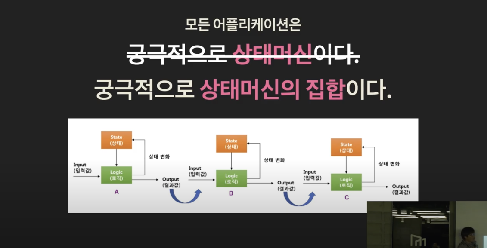
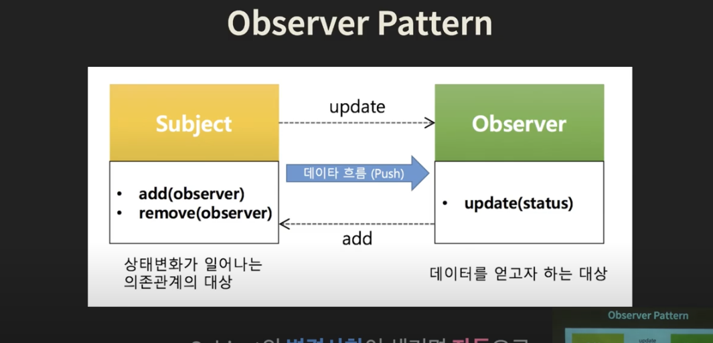
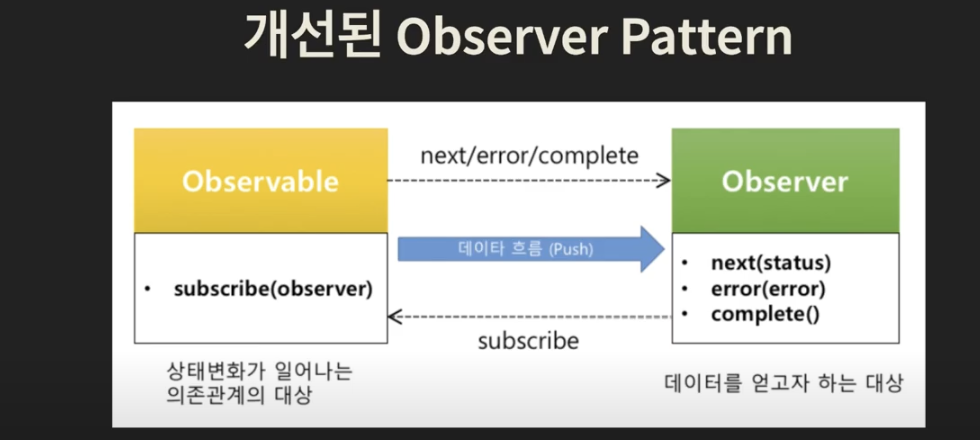
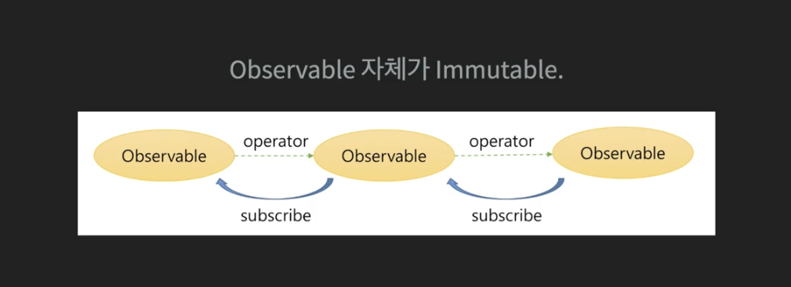
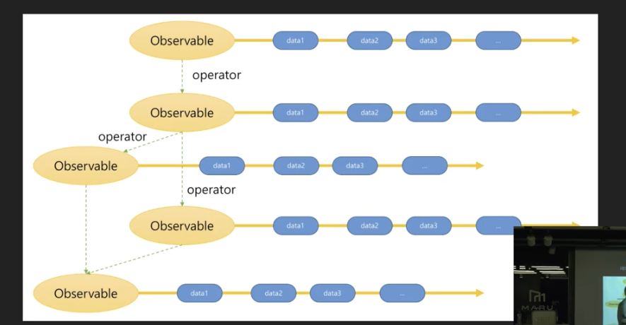
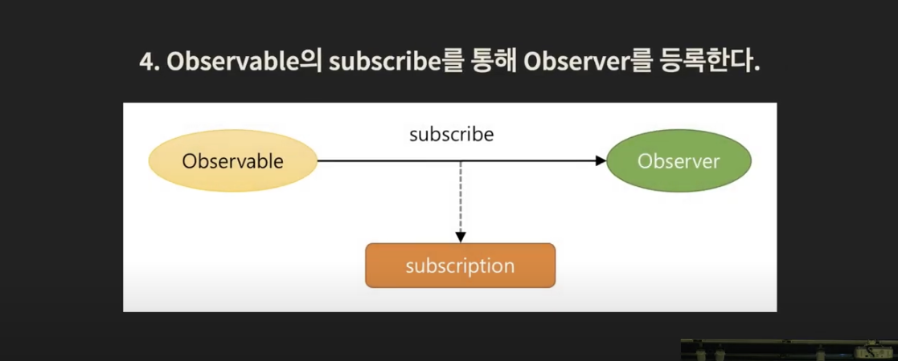

# 쉽게 써봅시다. RxJS!

[쉽게 써봅시다. RxJS!][https://www.youtube.com/watch?v=2f09-veX4HA]

## 발표 : 손찬욱


### RxJS 는 담당하는 영역.

1. 비동기 처리
2. 데이터 전파 
3. 데이터 처리

RxJS 는 `일관 된 방식으로, 안전하게, 데이터 흐름을 처리하는` 라이브러리 입니다.


모든 어플리케이션은 궁극적으로 상태 머신 입니다.

입력값 (INPUT) -> 로직 (Logic) -> 상태 변화 -> 상태 (State) -> 로직 (Logic) -> 결과 값 (Output)


개발자가 처리하는 `입력 값 Input` 은 어떤 것들이 있을까요?

배열 데이터도 입력값으로, 함수 반환값도 입력값으로.
키보드를 누르는 것도 입력값, 마우스를 움직이는 것도 입력값,
원격지의 데이터도 입력값, DB 데이터도 입력값으로.

이런 입력 값들을 처리 해야 합니다.

어떤 것은 동기, 어떤 것은 비동기.
어떤 것은 함수 호출(Call), 어떤 것은 이벤트(Event),
어떤 것은 Callback, 어떤 것은 Promise

각각에 따라 처리해야 합니다.

배열 데이터를 처리하는 경우.  arr[0], arr[1], arr[2]
함수를 호출한 경우.  call, call, call
마우스를 클릭하는 경우.  click, click, click
Ajax 를 호출한 경우.  request, response
------------------------------------> Time 

모든 데이터는 시간을 축으로 하나의 형태.
시간축 관점에서 결국 동기 === 비동기.
Rxjs 는 하나의 방식으로 처리하자 -> `인터페이스의 단일화.`


### Observable 시간을 인덱스로 둔 컬렉션.

[data, data, data, data, data, data, data, data]
-----------------------------------------------> Time 

동기, 비동기, 함수 호출, 이벤트, Callback, Promise 다 필요 x -> `모두 Observable 로 처리합니다.`
그래서 결국 비지니스 로직에 더 집중해서 코드를 짤 수 있습니다.

모든 애플리케이션은 궁극적으로 `상태 머신` 입니다. 따지고 보면 상태 머신은 x
궁극적으로 상태머신의 집합입니다.



의존관계가 있는 상태머신에게 변경된 상태 정보를 어떻게 전달할까요?


### Reactive Programming 

데이터 흐름과 상태 변화 전파에 중점을 둔 프로그램 패러다임입니다.
사용되는 프로그래밍 언어에서 데이터 흐름을 쉽게 표현할 수 있어, 기본 실행 모델이 변경 사항을 `데이터 흐름을 통해 자동으로 전파한다는 것을 의미합니다.`

이미 우리는 알고 있었다 Observer Pattern 



Subject 의 변경사항이 생기면 자동으로, Observer 의 update 를 호출 한다. 

observer 는 update 라는 것을 모릅니다.
`두 개의 관계 문제가 생겨도 문제를 쉽게 해결 할 수 있습니다.`


Rxjs 는 Observer Pattern 을 적용하자, 상태 자동전파 Loosely Coupling 


개선된 Observer Pattern 



next, error, complete 의 3가지 상태를 전달 받습니다.


###  데이터를 받은 후에는 뭐하니?

데이터를 받은 후에 받은 데이터를 가공 합니다.

1. Ajax 로 데이터를 받음.

``` javascript
const xhr = new XMLHttpRequest();
xhr.onreadystatechange = function () {
    if (xhr.readyState == 4 && xhr.status == 200) {
        const jsonData = JSON.parse(xhr.responseText);
        document.getElementById("users").innerHTML = process(jsonData); 
    }
};
xhr.open("GET", "https://swapi.co/api/people/?format=json");
xhr.send();
```

2. 데이터를 가공함 process 함수.

``` javascript
// 데이터를 처리하는 함수.
function process(people) {
    const html = [];
    for (const user of people.results) {
        if (/male|female/.test(user.gender)) {
            let broca;
            let bmi;
            if (user.gender == 'male') {
                broca = (user.height - 100 * 0.9).toFixed(2);
                bmi = (user.height / 100 * user.height / 100 * 22).toFixed(2)
            } else {
                broca = (user.height - 100 * 0.9).toFixed(2);
                bmi = (user.height / 100 * user.height / 100 * 21).toFixed(2)
            }
            const obesityUIsingBroca = ((user.mass - broca) / broca)
            const obsityUsingBmi = ((user.mass - bmi) / bmi * 1)
        }
    }
}
```

개발자의 고민 중 하나

조건문, 반복문 덩어리로 구성됨.

``` javascript
if (A) {
    // 이럴 경우에는.
    for (let i = 0; i < len; i++) {
        // 실제 로직 A는 여기서...
    }
} else {
    // 저럴 경우에는
    for (let ...)
}
```

`조건문`은 코드의 흐름을 분리하고,
`반복문`은 코드의 가독성을 떨어뜨림.

- `주관심사인 비즈니스 로직은 코드에 파묻힙니다.`

Rxjs 는 이런 문제를 해결하기 위해 `고차 함수를 제공합니다.`

고차 함수란? - 다른 함수를 인자로 받거나, 그 결과로 함수를 반환하는 함수.

고차 함수는 변경되는 주요 부분을 함수로 제공함으로써, `동일 패턴 내에 존재하는 문제를 손쉽게` 해결할 수 있는 프로그래밍 기법 입니다.


filter, map, reduce, ... 와 같은 고차함수의 operator 를 제공합니다.

``` javascript
Rx.Observable
    .ajax("https://swapi.co/api/people/?format=json")
    .filter(user => /male|female/.test(user.gender))
    .map(user => Object.assign(
        user,
        logic(user.height, user.mass, user.gender) // 비즈니스 로직.
    ))
    .reduce((acc, user) => {
        acc.push(makeHtml(user));
        return acc; 
    }, []);
    .subscribe(...)
```

개발자의 고민 중 하나,
내가 실행한 로직이 나의 의도와 상관없게, 외부에 영향을 미친다면? `Side Effect`

함수에 드러나지 않은 입력값이 부원인(Side Cause) 라고 하고 이로 인해 발생한 결과를 부작용 (Side Effect)

``` javascript
function getCurrentValue(value) {
    return processAt(value, new Date()); 
}

function get(objectValue) {
    objectValue.newProp = '바꿧지롱 모르겠지?';
    return objectValue; 
}
```

애가 바뀌었으면, 새로 함수 상태를 순수 함수 형태로 되기를 원합니다.
컨트롤 하기 편하니까.


``` javascript
// 모든 입력값을 명시적으로 나태난다.
function getCurrentValue(value, time) {
    return processAt(value, time); 
}

// Immutable 데이터를 사용한다.
function get(objectValue) {
    const obj = Object.assign({}, objectValue);
    obj.newProp = '바꿨으면 데이터 객체의 레퍼런스를 바꾸야지';
    return obj;
}
```

Function Programming 은 자료 처리를 수학적 함수의 계산으로 취급하고, `상태 변경과 가변 데이터를 피하려는` 프로그래밍 패러다임의 하나 입니다.

Function Programming 은 순수 함수를 지향한다.
같은 입력이 주어지면, 항상 같은 출력을 반환한다.
부작용(side-effect)를 발생시키지 않는다.
외부의 Mutatble 한 데이터에 의존하지 않는다.



###  맛만 보기

RxJS 다루는 중요 개념은 다음과 같습니다.

- Observable
- Operator (map, filter ..)
- Observer (Observer 관찰)
- Subscription (Observer 연결)
- Subject
- Scheduler 

4대 천왕만 알면 됩니다.
다른거는 심화과정 (Subject, Scheduler)

1. 데이터 소스를 Observable 로 생성.

Source -> Observable -> data1 -> data2 -> data3 ..


2. Observable 의 operator 를 사용.

데이터를 변경, 추출, 합침 분리. 




3. 원하는 데이터를 받아 처리하는 Observer 를 만듭니다.

``` javascript
const observer = {
    next: x => console.log("Observer 가 Observable 로 부터 받은 데이터 : " + x),
    error: err => console.error("Observer 가 Observable 로 부터 받은 에러 데이터 : " + err)
    complete: () => console.log("Observer 가 Observable 로 부터 종료 되었다는 알림 ")
}
```

4. Observble 의 subscribe 를 통해 Observer 를 등록합니다.




5. Observable 구독을 정지하고 자원을 해지합니다.

``` javascript
subscription.unsubscribe();
```

[여기에서 이야기한 자세한 설명은 다음 사이트에서 보실 수 있습니다.][https://github.com/sculove/rxjs-book]