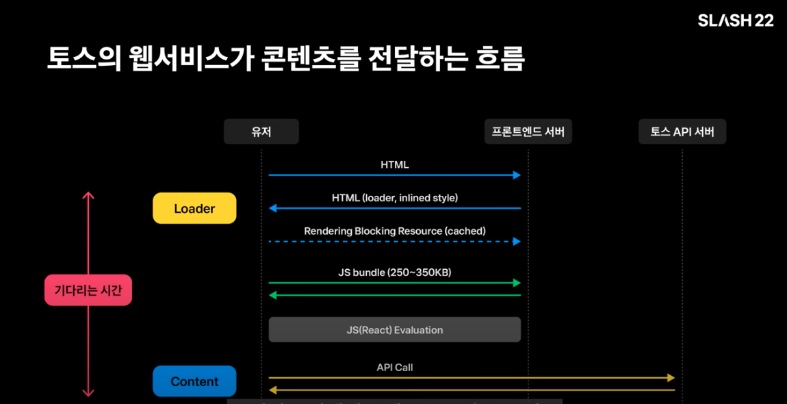
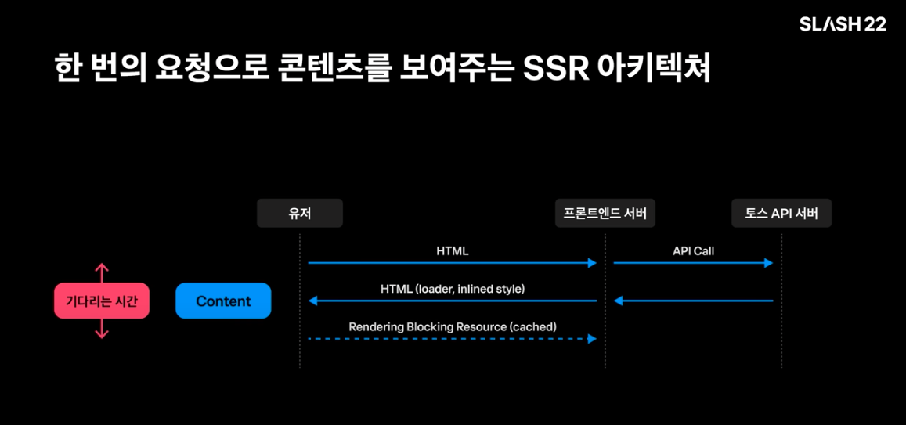
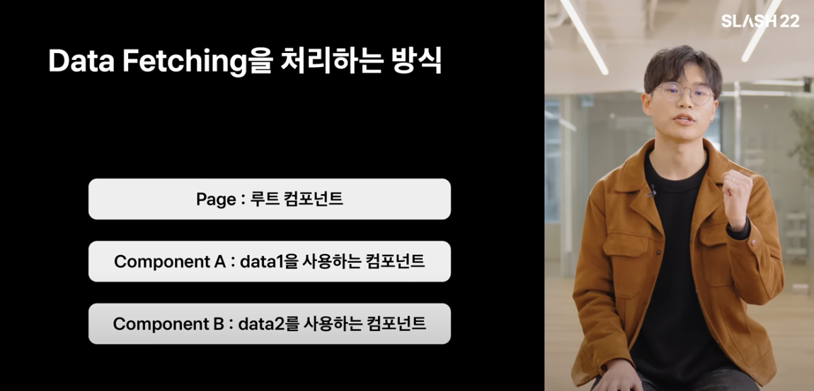
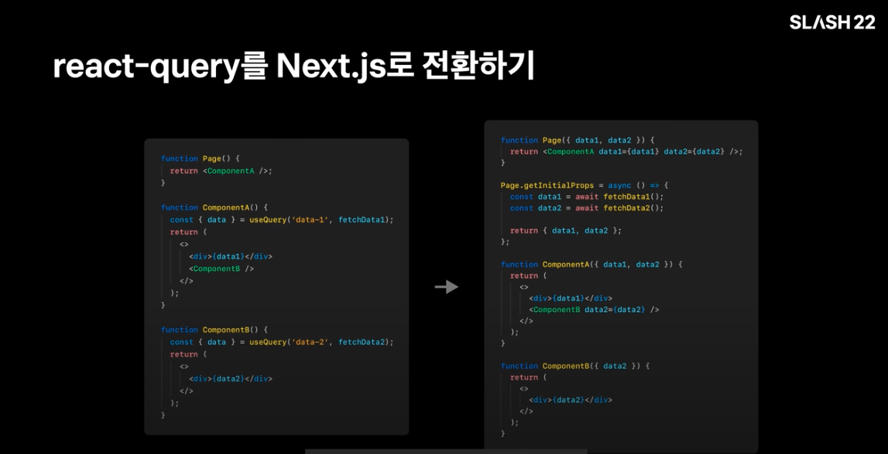
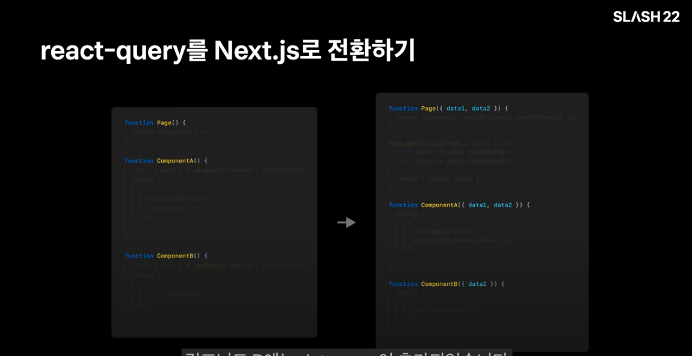

# 100년을 아껴준 SSR 이야기 

[토스ㅣSLASH 22 - 잃어버린 유저의 시간을 찾아서 : 100년을 아껴준 SSR 이야기](https://www.youtube.com/watch?v=IKyA8BKxpXc&t=437s)

<h2>100년을 아껴준 SSR 이야기</h2>

<br/>

## 발표 : 김도환 Frontend DevOps Engineer 

<br/>

SSR 통해서 웹 서버 로딩 시간을 줄였는 지 이야기 해볼려고 합니다.<br/>
토스의 웹서비스가 콘텐츠를 전달하는 흐름 - Hydration 기법.

<br/>



<br/>

유저에게 콘텐츠를 전달하기까지의 과정.

1. HTML 요청에서 응답을 받고.
2. JavaScript 번들을 요청해서 응답을 받고,
3. 번들을 실행하고
4. API 서버로부터 응답을 받기.

하지만 4단계까지 끝나야 그동안 사용자가 계속 로더를 보면서 기다려야 합니다.<br/>
토스는 이 문제를 해결하기 위해 한 번의 요청으로 콘텐츠를 바로 보여줄 수 있는, 새로운 아키텍쳐를 설계 (SSR)



<br/>

브라우저에서 토스 API 서버로 요청을 보내는 것 보다, 훨씬 빠르게 응답을 받을 수 있습니다.<br/>
API 가져온 값을 이용해서 서버 사이드 렌더링을 할 수 있습니다.

즉 유저는 한 번의 요청만으로, 보고 싶던 콘텐츠를 바로 보게 됩니다.

1. Javascript 번들을 불러오는 시간
2. 번들을 실행하는 시간.
3. 브라우저가 토스 API 서버로부터 응답을 받는 시간을 아낄 수 있게끔.

유저가 훨씬 더 콘텐츠를 빠르게 볼 수 있습니다.
Next.js 를 사용하면 SSR 를 손 쉽게 구현 할 수 있습니다.

<br/>
<br/>

### Next.js : SSR made easy 

<br/>
Page 단위 Server-side Data Fetching 


``` javascript
function Page ({ stars }) {
    return <div>Next stars: { stars }</div>
}

Page.getInitialProps = async (ctx) => {
    const res = await fetch('http://api.github.com/repos/vercel/next.js')
    const json = await res.json();
    return { stars: json.stargazers_count }
}

export default Page 
```

페이지 단위로 서버 사이드에서 값을 가져와 사용 할 수 있습니다.

구현은 간단합니다.

페이지라는 최상위 컴포넌트.
최상위 컴포넌트에 getInitialProps property 에 함수를 선언합니다.

해당 함수에서 서버로 부터 데이터를 가져온 뒤, 해당 데이터를 사용한 props 를 리턴해주면 페이지 컴포넌트는 그 props 를 바로 사용할 수 있습니다.

클라이언트 사이드에서는 데이터를 가져올 필요가 없습니다.


만약 이런 식으로 데이터 처리 방식이 있다면 어떻게 처리 해야 할까요~?



다양한 방식으로 구현 할 수 있습니다.

첫 번째는 props Drilling 입니다.

``` javascript
function Page() {
    const data1 = useFetch(fetchData1);
    const data2 = useFetch(fetchData2);

    return <ComponentA data1={data1} data2={data2} />; 
}

function ComponentA({ data1, data2 }) {
    return (
        <>
             <div>{data1}</div>
            <ComponentB data2={data2} />
        </>
    )
}

function ComponentB({ data2 }) {
    return (
        <>
            <div>{data2}</div>
        </>
    )
}
``` 

이런 식으로 전달하면 문제 없이 데이터를 처리 할 수 있지만,
컴포넌트마다 본인의 관심사가 아닌 data를 알게 되는 문제가 발생합니다.

Page는 data1, data2 를 직접적으로 사용하지 않고,
컴포넌트 A는 data2를 사용하지 않는데도, 자식에게 내려주기 위해 선언 해 주어야 합니다.

이것을 해결하기 위해 Context API 쓰는 방법이 있습니다.

``` javascript
const DataContext = createContext();

function DataProvider({ children }) {
    const data1 = useFetch('data-1', fetchData1);
    const data2 = useFetch('data-2', fetchData2);

    return (
        <DataContext.Provider value={{data1, data2}}>
            {children}
        </DataContext.Provider>
    )
}
```

이렇게 되면 각 컴포넌트가 불필요한 관심사를 갖지 않게 됩니다.
하지만 Context API 는 re-render 최적화 문제를 해결해야 하고,
상태가 많아졌을 떄 코드가 복잡해 집니다.

SWR, React-Query 같은 Data Fetching Hook 사용하면 서버로부터 가져온 데이터를 간결 코드로 관리할 수 있습니다.

SSR 시점에는 useQuery 가져온 값이 undefined 이기 떄문에, 코드를 변경 해야 합니다.
useQuery 가져온 데이터를 Next.js 를 사용해서 변경하면 어떻게 될까요?



React-Query 를 Next.js 로 변환하면 모든 컴포넌트의 props 가 바뀌어야 합니다.
Page와 컴포넌트 A에 data1, data2 prop 이 추가되었고, 컴포넌트 B에는 data prop 이 추가되었습니다.



구현만 변경하는 것과 인터페이스만 변경하는 것이 큰 차이가 있습니다.
만약에 서비스 큰 곳에서 인터페이스를 변경해야 한다면? 마이그레이션 비용이 기하급수적으로 늘어나게 됩니다.


### Props Drilling 없이 SSR 을 구현할 순 없을까?

토스 커뮤니티에서는 Data fetching Hook 인 useResource 를 만들어서 이 문제를 해결 했습니다.

1. key와 fetch 함수를 명세해서 서버 사이드에서 가져올 리소스를 정의합니다.
2. 페이지 컴포넌트에 requiredResources 라는 property 에 정의한 리소스를 할당합니다.
3. 컴포넌트에서 useResource 라는 Hook에 정의한 리소스를 인자로 넣어서 사용합니다.
4. useQuery 와 유사한 방식으로 데이터를 가져올 수 있습니다.


``` javascript
// 1. 서버 사이드에서 가져올 리소스 정의하기.
const data1Resource = createResource({
    key: 'data-1',
    fetcher: async () => {
        return fetch('/api/data-1');
    },
});

// 2. Page에 사용할 리소스 명시하기.
function Page() {
    return <ComponentA />;
}

Page.requiredResources = [data1Resource]; 

// 3. useQuery처럼 사용하기.
function ComponentA() {
    const { data } = useResource(data1Resource);
    return (
        <>
            <div>{data}</div>
            <ComponentB />
        </>
    )
}
```

useQuery 와 유사한 방식으로, data 를 가져올 수 있습니다.
useQuery Hook 을 useResource Hook 으로 마이그레이션을 한다면? 
컴포넌트들의 props 를 변경 하지 않고, 구현만 바꾸는 것으로도 마이그레이션 할 수 있습니다.

컴포넌트의 인터페이스 변경 없이도 마이그레이션 가능 -> 더 쉽게 100+ 서비스에 SSR을 도입.
