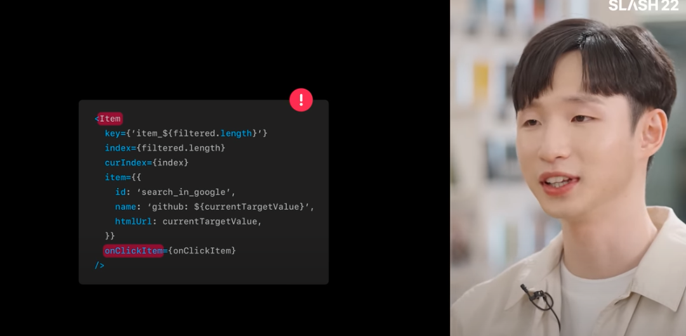
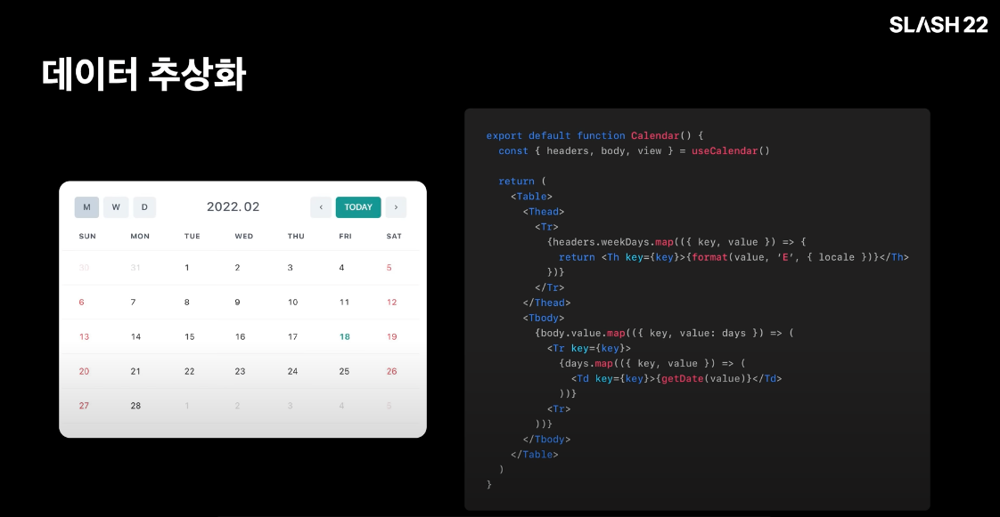
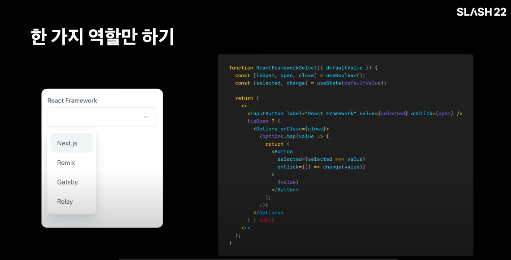
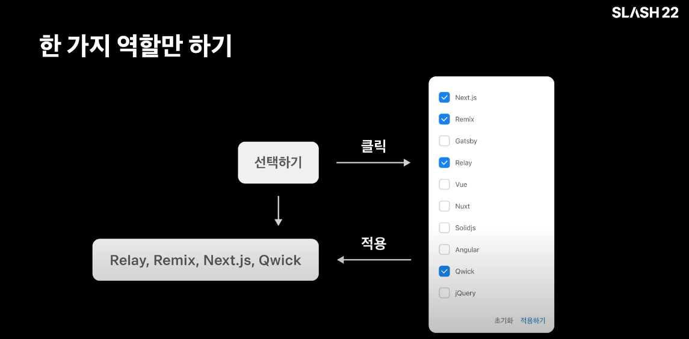
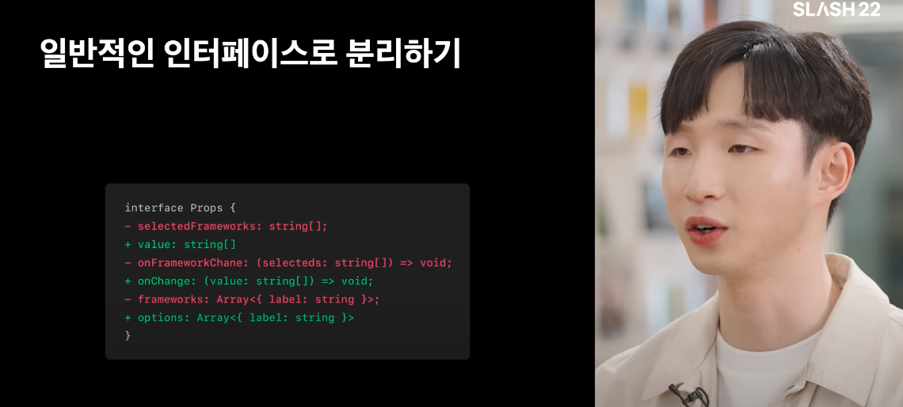

# Effective Component 지속 가능한 성장과 컴포넌트

[지속 가능한 성장과 컴포넌트](https://www.youtube.com/watch?v=fR8tsJ2r7Eg&t=549s)

<h2>지속 가능한 성장과 컴포넌트</h2>

<br/>
<br/>

## 발표 : 한재엽 Frontend Developer 

[Github](https://github.com/JaeYeopHan)<br/>
[Blog](https://jbee.io)

`사용자가 우리가 만든 제품을 어려움 없이 잘 사용 해야 합니다.`

- 지표는 그렇지 않다고 말합니다.
- 실제로도 붙잡고 말해도 그렇지 않음.

<br/>

디자인, API, 제품 방향 자체도 언제든 변경될 수 있습니다.<br/>
좋은 제품을 만들기 위해 변경이 필요합니다.<br/>
`올바른 방향으로 성장합니다.`

<br/>

사용자를 모르기 떄문에 어떤 변경이 발생할 지 미리 알 수 없습니다. --> `대응해야 합니다.`

<br/>
<br/>

## 변경에 대응하기

작은 컴포넌트 합치기 -> 커지면 적당히 분리하기


어떤 기준으로 코드를 분류할 까요?
`딱히 기준은 없었던 것 같습니다.`

`중복이라면서 특히나 분리 했던 것 같습니다.
단순히 크다는 이유로 분리 하거나.`




`Item 컴포넌트는 데이터를 어떻게 보여주는 지, 어떤 컴포넌트인지, 데이터를 어떻게 보여주는 지 전혀 알 수 없습니다.`<br/>
item에 item 이라니..

이 컴포넌트가 무슨 역할인지 무슨 생각으로 만들었는 지 알 수 없습니다.

<br/>
<br/>


## 컴포넌트 잘 만들기 

<br/>
<br/>

### Headless 기반의 추상화하기.

    - 변하는 것 VS 상대적으로 변하지 않는 것.

컴포넌트는 3가지 역할.

1. 데이터 관리 
2. UI 어떻게 데이터를 보여줄지.
3. 사용자와 어떻게 상호작용 할 지.

``` javascript
export function Button() {
    const [state, setState] = useState<boolean>(false); // 데이터
    
    return (
        <button // UI 
            onClick={() => { // User 
                setState(x => !x); 
            }}
        >   
            버튼 {state ? 'on' ? 'off'}
        </button>
    )
}
```

달력 컴포넌트를 만든다고 가정.<br/>
달력을 구성하는 데이터 자체는 변하지 않지만, `달력의 UI는 언제든지 바뀔 수 있습니다.`

예제코드 에서는 2x2 배열의 달력처럼 보이게 가정.<br/>
또다른 달력 컴포넌트가 디자인이 다르더라도, useCalendar hooks 를 가져다 사용할 수 있습니다.

달력을 구성하는 데 필요한 데이터를 계산하는데, 이 역할을 useCalendar hooks 에 위임한 것 입니다.



`UI를 관심사에서 제외 할 수 있습니다.`<br/>
오로지 데이터에만 집중해서 모듈화 할 수 있습니다.<br/>
이런 패턴을 `Headless` 이라고 합니다.

`한 가지 문제에서 집중하므로 다른 변경으로 격리시킬 수 있습니다.`

상호작용과 UI를 어떻게 분리할 수 있을까?<br/>
Button 컴포넌트 내부에 Long Press 라는 동작을 정의하려고 합니다.

`컴포넌트 내부에 여러 가지 로직이 들어갑니다.`
이러면 컴포넌트 내부가 복잡 해 집니다.

상호 작용 부분을 따로 추상화 할 수 있습니다.
useLongPress 라는 hooks 를 만들었습니다. 
따로 상호 작용 부분도 추상 화 해주기. useLongPress Hook을 만들어 주기.


``` javascript
interface Props extends ComponentProps<typeof Button> {
    onLongPress?: (event: LongPressEvent) => void; 
}

// export function PressButton({ onLongPress, ...props}: Props) {

// }
export function PressButton(props: Props) {

    const longPressProps = useLongPress();

    return <Button {...longPressProps} {...props} />
}

function useLongPress() {
    return {
        onKeyDown={(e) => {
            // ...
        }}
        onKeyUp={(e) => {
            // ...
        }}
        onMouseDown={(e) => {
            // ...
        }}
        {...props}
    }
}
```

<br/>
<br/>
<br/>


### 한 가지 역할만 하기.

    - 또는 한 가지 역할만 하는 컴포넌트의 조합으로 구성하기.


복잡한 컴포넌트는 어떨까요?
흔하게 볼 수 있는 Select UI.

자연스럽게 작은 컴포넌트들을 사용합니다.



컴포넌트를 다른 곳에서 사용한다면?
label 만 달라져도 어렵습니다.

props 에서 label 을 받도록 수정.<br/>
`InputButton 대신 다른 컴포넌트를 사용하고 싶다면?` 어떻게 해줘야 할까?


일단 Menu 노출 여부를 제어하는 내부 상태 isOpen 을 분리할 수 있습니다.<br/>
이 상태를 DropDown 으로 분리할 수 있습니다. `isOpen -> Dropdown` <br/>
상태를 바꾸기 위한 상호작용도 바꿀 수 있습니다. `Tigger -> Dropdown.Tigger` <br/>
옵션 영역도 분리 해줄 수 있습니다 (닫힌 열부 노출 여부). `Menu -> Dropdown.menu` <br/>
메뉴 각각의 아이템 - Item -> `Dropdown.Item` <br/>


``` javascript
function Select({ label, triggrt, value, onChange, options }: Props ) {
    return (
        <Dropdown label={label} value={value} onChange={onChange}>
            <Dropdown.Trigger as={trigger} />
            <Dropdown.Menu>
                {options.map(option => (
                    <Dropdown.Item>{option}</Dropdown.Item>
                ))}
            </Dropdown.Menu>
        </DropDown>
    )
}
```

재구성한 코드는 다음과 같습니다.<br/>
Select 컴포넌트와 tigger 전달한 InputButton 컴포넌트는 서로 존재에 대해 알 지 못합니다.

``` javascript
function FrameworkSelect() {
    const {
        data: { frameworks },
    } = useFrameworks(); 
    const [selected, change] = useState();

    return (
        <Select
            trigger={<InputButton value={selected} />}
            value={selected}
            onChange={change}
            options={frameworks}
        />
    )
}
```

이렇게 합성 가능하도록 만들면 재사용하기 쉽습니다.<br/>
조금 더 복잡한 컴포넌트를 봅시다.


버튼을 클릭하면 modal 이 나옵니다.
체크박스로 선택 할 수 있습니다.




체크하고 적용하기 누르면 선택한 값들이 노출 됩니다.<br/>
꽤 복잡한 컴포넌트라는 생각이 듭니다.

데이터 중심으로 바라본다면 복잡한 컴포넌트는 아님.<br/>
사실 이 컴포넌트는 옵션을 제공하고, 선택한 값을 보여주는 컴포넌트로 보여주면 되지 않을까?


Button 컴포넌트로 메뉴를 보일지 말지 상호 작용 할 수 있습니다.<br/>
그리고 Modal UI 로 노출되는 부분을 따로 보여주었습니다.

적용하기 버튼은 모달의 하나를 form 으로 바라봤습니다.

``` javascript
function FrameworkSelect({
    selectedFrameworks,
    onFrameworkChange,
    frameworks, 
}: Props) {
    return (
        <Dropdown value={selectedFrameworks} onChange={onFrameworkChange}>
            <Dropdown.Trigger 
                as={<Button>{String(selectedFrameworks ?? '선택하기')}</Button>}
            />
            <Dropdown.Modal
                controls={
                    <Flex>
                        <Button type="reset">초기화</Button>
                        <Button type="submit">적용하기</Button>
                    </Flex>
                }
            >
            {frameworks.map(framework => {
                return <Dropdown.Item>{framework}</Dropdown.Item>
            })}
            </Dropdown.Modal>
        </Dropdown>
    )
}
```

<br/>
<br/>
<br/>


### 도메인 분리하기.

    - 도메인을 포함하는 컴포넌트와 그렇지 않은 컴포넌트 분리하기.
  


일반적인 인터페이스로 분리하기.
 
모든 컴포넌트에서 데이터에 접근 할 수 있지만,
컴포넌트를 주입받는 것처럼 데이터를 주입받으면 어떨까요?

방금 만들었던 것을 도메인을 한 번 분리해 봅시다.
도메인 맥락을 제거 해주기.



`일반적인 이름으로 바뀌게 됩니다.`<br/>
`컴포넌트의 역할을 이해하기 쉽다.`<br/>
`사람은 무언가 파악할 떄 기존에 알고 있던 내용을 바탕으로 파악합니다.`

`최대한 많은 사람들이 알만한 것 일반적 단어로 표현해야 이해하기 쉽습니다.`


<br/>

### 바로 시도해 볼 수 있는 Action 아이템.
<br/>

`인터페이스를 먼저 고민하기. (미리 만들어 있다고 가정하고 그것을 사용하듯이 생각하기)`<br/>
`의도가 무엇인가?`<br/>
`이 컴포넌트의 기능은 무엇인가?`<br/>
`인터페이스로 어떻게 표현되어야 하는 지가 구현 보다 중요합니다.`<br/>


컴포넌트를 나누는 이유를 생각해 보기.

모든 로직이 한 곳에 있으면 파악하기 힘듭니다.<br/>
`여러 개의 컴포넌트로 나누어 개발 합니다.`

반복되는 부분을 모듈화하면 좋다는 것을 알 수 있습니다.
바로 가져다 쓰는 짜릿함.

`컴포넌트를 나누는 행위가 복잡도를 낮추는 것인가? 재사용 ? 꼭 분리해야 하는가? 고민해보기`

